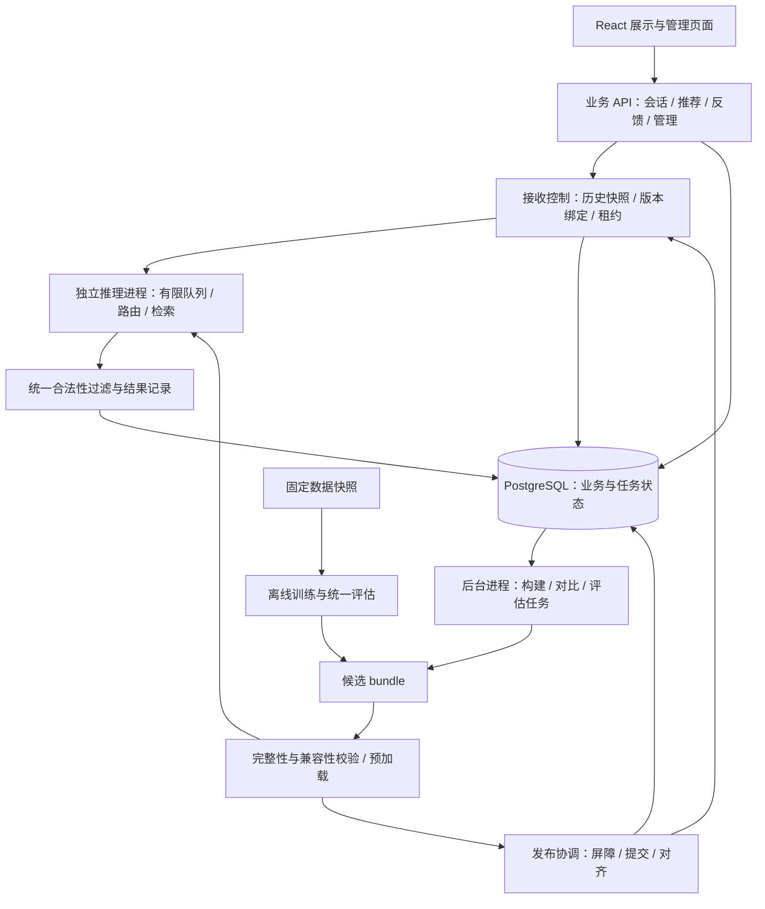
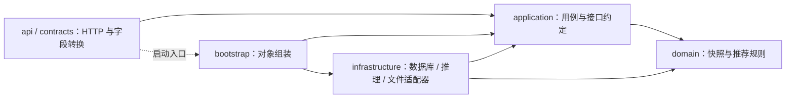
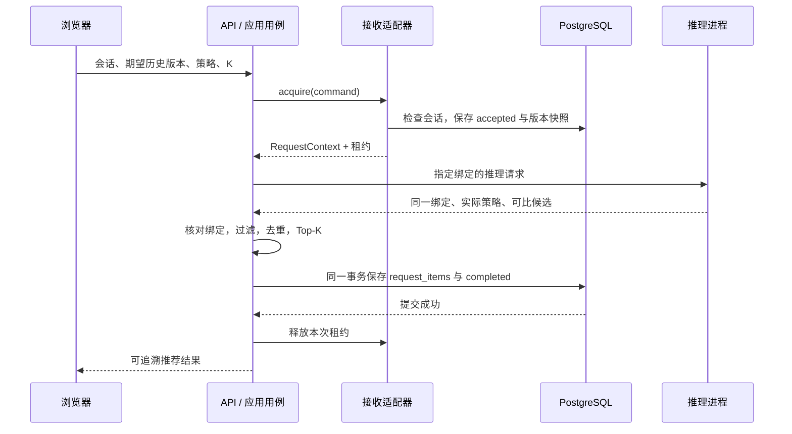

# EvoRec 系统架构

版本：0.3｜更新：2026-09-22｜阶段：M1 进程内闭环

**架构决定：采用模块化单体代码结构，围绕版本化产物连接离线研究和在线推荐；接入模型后，以业务 API、推理进程和后台任务进程隔离运行职责。** 首版面向个人开发与单机演示，先完成可复现实验和可追溯推荐，再根据测量决定扩展。

本文既包含已经落地的代码边界，也规定后续实现必须遵守的运行协议。PostgreSQL 核心迁移及会话/推荐适配器已实现；在线模型推理、反馈、后台发布和前端仍待实现，R01–R06 离线研究已完成。HTTP 层调用真实应用用例；配置数据库后会话、请求和结果可跨应用实例恢复，未配置时回退到进程内演示。进度与实测证据见 [STATUS](STATUS.md)。

## 1. 架构服务于什么问题

EvoRec 的研究主线是动态商品库中的推荐：训练交互未覆盖的商品如何进入候选，以及请求预算怎样影响推荐质量。架构需要让不同方法使用一致的数据协议和候选规则，并让每个线上结果能够对应到真实模型与商品版本。

| 目标 | 架构要求 | 验证方式 |
| --- | --- | --- |
| 公平比较算法 | 固定数据切分、合法商品集合和统一评价入口 | 基线复现、泄漏检查、逐请求指标 |
| 追溯推荐结果 | 保存会话快照、版本组合、实际执行策略 | 根据请求记录定位输入和产物 |
| 支持新品与下架 | 构建新产物，显式发布，独立维护下架版本 | 发布与并发请求故障测试 |
| 控制计算成本 | 有限队列、端到端截止时间、分阶段计时 | 实机延迟分位数和负载测试 |
| 个人可维护 | 单仓库、清楚的依赖方向、按里程碑接入 | 可独立运行的用例与边界检查 |

PRD 中的延迟、吞吐和新品可用时限均为待验证目标；本文不提供已达成承诺。C++ 扩展在性能分析后决策，算法质量由实验支持。

## 2. 系统全景与进程边界



图中除状态 API 及下文列出的领域和应用代码外，均为目标组件。

| 运行单元 | 首版数量与职责 | 交互方式和资源约束 |
| --- | --- | --- |
| Web 页面 | 一个前端应用，展示与管理按权限分区 | 仅调用业务 API，不能直连数据库或推理进程 |
| 业务 API | 一个进程、一个接收协调者 | 校验、短事务、结果记录；进程内锁只在此前提下有效 |
| 推理进程 | 一个模型运行时 | 内部 HTTP 适配器承载有限大小请求；自行管理队列、模型与索引租约 |
| 后台任务进程 | 一个执行者起步 | 领取持久任务；CPU 构建可独立运行，GPU 作业与展示错峰 |
| 离线研究 | 独立环境与命令入口，按需运行 | 固定数据与配置，输出不可变产物和实验记录 |
| PostgreSQL | 一套业务数据库 | 保存会话、结果、任务、发布控制与运行索引 |
| 本地产物目录 | 单机共享文件系统 | 发布后只读；API 不接收客户端指定的本地路径 |

内部 HTTP 传输的是历史商品 ID、版本标识、候选和计时信息，模型权重留在推理进程。完整合法商品集合由 bundle 和下架版本解析，不能每次把整个商品库序列化跨进程传输。单机演示只监听回环地址；跨主机或增加 API 副本时，先升级协调和授权设计。

训练依赖与服务依赖分别记录。研究环境已复用本机 PyTorch 2.9.0+cu126 并完成 GPU 训练，当前采用 system-site-packages，尚未验证干净环境复建；PostgreSQL 演示适配器已接入，Faiss、内部模型 HTTP 服务和三个进程的启动编排尚未接入。

## 3. 代码分层与依赖方向



领域层不导入 FastAPI、Pydantic、数据库或模型库。应用层依赖领域对象和 Protocol 接口；适配器实现这些接口。接口层负责 HTTP 转换，bootstrap.py 负责把对象接起来。api/app.py 是允许调用组装入口的明确例外。

```text
src/evorec/
├── domain/
│   ├── models.py          不可变会话、商品快照、请求绑定与结果
│   ├── recommendation.py  合法性过滤、去重、稳定 Top-K
│   └── errors.py          历史冲突、快照不一致、未说明回退
├── application/
│   ├── ports.py           接收、排序、记录、就绪四个接口
│   ├── recommend.py       推荐应用用例，已由进程内演示路由调用
│   └── health.py          就绪查询用例
├── infrastructure/
│   ├── memory.py          进程内会话、接收、热门排序及结果记录
│   └── readiness.py       当前未配置持久依赖的真实阻塞状态
├── api/app.py             状态、会话、推荐路由及启动入口
├── contracts.py           Pydantic 外部输入契约
└── bootstrap.py           默认依赖组装
```

以上文件均已建立。[分层检查](../tests/test_architecture.py) 对静态导入方向设限；它不验证动态导入，也不替代运行时集成测试。

采用 Python Protocol 描述适配器应提供的方法，便于应用层保持独立；它本身不会自动验证分布式一致性。类型机制见 [Python 官方文档](https://docs.python.org/3.12/library/typing.html#typing.Protocol)。HTTP 层后续可以通过 FastAPI 依赖注入接入请求身份和事务资源，框架机制见 [FastAPI 官方文档](https://fastapi.tiangolo.com/tutorial/dependencies/)；当前使用显式构造注入。

## 4. 核心对象与适配器职责

| 对象 | 内容 | 不变量 |
| --- | --- | --- |
| RecommendationCommand | 请求 ID、会话 ID、期望历史版本、策略、K、超时 | K 为 1–50，版本非负，超时有限且为正 |
| SessionSnapshot | 会话、epoch、历史版本、历史和屏蔽集合 | 接收后保持不变；重置不会改写已接收快照 |
| CatalogSnapshot | bundle ID、下架版本、合法商品集合 | 集合对应同一版本；大集合可在进程内共享 |
| RequestBinding | 请求、会话、epoch、历史版本、bundle、下架版本 | 推理返回必须逐项匹配接收时的绑定 |
| RankedBatch | 绑定、实际策略、有限分数候选、回退原因 | adaptive 必须解析成具体路径；异构分数已完成融合 |
| RecommendationResult | 绑定、请求策略、实际策略、最终商品 | 只含合法且去重的结果，不重复填充 K |

详细定义见 [领域对象](../src/evorec/domain/models.py)。冻结数据类防止请求内意外修改；真实数据是否来自一致快照，仍取决于适配器的事务和发布协议。

| 接口 | 实现方必须承担的职责 | 当前实现状态 |
| --- | --- | --- |
| AdmissionPort.acquire | 验证访问与历史版本；持久记录接收；绑定会话与商品快照；获得和释放租约；终结失败请求 | 进程内与 PostgreSQL 适配器已接入 |
| RankingPort.rank | 使用指定 bundle；有限队列；可比候选分数；准确回传绑定与执行策略；取消与远端资源管理 | 演示热门排序已接入；模型适配器待实现 |
| ResultRecorderPort.save | 以 request_id 幂等保存商品位置、分数和完成状态，成功返回之前提交 | PostgreSQL 事务保存已接入；完成内容对账待补齐 |
| ReadinessPort.check | 检查数据库、运行时、活动版本和接收屏障 | PostgreSQL、活动版本和屏障探针已接入；模型探针待实现 |

方法签名见 [ports.py](../src/evorec/application/ports.py)。公开演示应用注入独立的进程内适配器，不注入测试代码；该适配器的易失状态边界在接口说明中明确暴露。

## 5. 推荐请求链路



目标接收事务在短临界区内完成：检查接收屏障，锁定会话行、核对当前权限与历史版本，取得当前运行快照，保存 accepted，再释放锁。长时间的模型计算不占用会话行锁。发布操作和下架操作通过同一接收协调者串行进入版本切换阶段。

已经实现的 [Recommend.execute](../src/evorec/application/recommend.py) 负责以下顺序：申请上下文 → 核对请求与历史 → 调用排序适配器 → 核对全部绑定字段 → 检查策略回退 → 统一后处理 → 等待结果保存 → 返回。

例如候选为 A:0.8、A:0.6、B:0.8、已下架C:0.9，最终保留 A、B；同分按商品 ID 排序，重复商品保留最高分，同分重复项按来源名称确定选择。历史已交互、已屏蔽或不在合法集合中的商品被过滤。只有两个合法候选时，即使请求 K=10，也返回两个。

融合发生在排序适配器内部。生成概率、向量相似度与热门分数不能原样混排；融合方法、候选配额与校准参数必须进入配置，并在验证集选择。应用层仅消费已经可比的最终排序分数。

超时覆盖接收、排队、计算和结果保存。asyncio.timeout 只取消可协作的异步调用，不会强制终止已经发射的 GPU 工作。推理进程需要为仍在运行的请求独立保留模型租约，直到真正完成或确认取消。若提交结果时连接断开，数据库结果可能已经提交；恢复时按请求 ID 查询和核对，不能直接认定失败或重复执行。

## 6. 反馈、重置与事务边界

反馈处理目标是一次事务内完成：校验会话归属 → 按 event_id 查询与比较规范化载荷 → 检查返回商品与当前 epoch → 写事件 → 更新显式状态及历史版本。收藏、屏蔽采用设置 true/false；重复提交不会反转状态。

对已成功处理的同 ID 同内容重试，返回原处理结果且不再次修改会话；这个去重检查先于“新的旧 epoch 事件”拒绝。会话重置递增 epoch 和历史版本；从未处理过的旧 epoch 反馈返回 409。客户端时间只用于观察记录，不决定并发写入顺序。

接收推荐与反馈都通过同一会话行锁串行读取或更新状态；仅接收推荐不递增历史版本。推荐离开接收事务之后，用户仍可产生新反馈；本次推荐继续使用已保存快照，并在响应中返回绑定版本，前端据此识别过期结果。以上事务、授权和响应转换在 M1 实现。

## 7. 模型与商品库的版本组合

一个 bundle 是可以共同加载的模型、编码器、映射和索引组合。产物目录发布后不可变，数据库保存引用与校验值。内容索引与生成模型可以有不同训练截止时间，但必须在清单中明确记录。

| 清单字段组（目标契约） | 必须记录与核对的内容 |
| --- | --- |
| 身份与来源 | schema_version、bundle_id、构建任务、代码版本及改动、创建时间 |
| 数据协议 | 数据快照校验值、训练截止、可用时间代理规则、静态资料限制 |
| 模型与表示 | 检查点、tokenizer、内容编码器、语义码本的 ID 与哈希 |
| 商品映射 | 外部 ID 到内部 ID 映射、商品集合指纹、条数 |
| 索引契约 | 向量维度、数值类型、归一化、距离度量、索引构建参数 |
| 策略契约 | 支持路径、融合配置、路由特征定义、候选预算 |
| 文件清单 | 相对于 bundle 根目录的路径、字节数、SHA-256 |
| 验证结果 | 加载、映射、合法性与小样本一致性检查的记录位置 |

加载器只接受受管产物根目录内的路径，拒绝越界路径；所有引用文件均需与清单相符。内容编码器、语义码本或 ID 映射变化时重新验证依赖，必要时重建索引和训练模型。文件存在不代表兼容。

下架集合独立于模型 bundle 管理。请求合法集合定义为“当前 bundle 包含的可推荐商品，减去该下架版本的排除项”。导入数据库成功尚不代表进入活动 bundle，更不代表获得实际曝光。

## 8. 发布、下架与崩溃恢复

发布采用单协调者与接收屏障。屏障关闭期间，存活接口可继续返回 200，业务就绪返回 503，新推荐请求返回可重试错误。已有请求可以完成其绑定版本的工作。

1. 后台构建独立候选目录，校验清单和兼容性，状态进入 ready。
2. 推理进程预加载候选；内存不足以容纳两个版本时，进入维护窗口并排空旧任务后加载，不能承诺无中断切换。
3. 协调者关闭新请求接收，等待正在进行的短接收临界区结束。
4. 数据库事务锁定控制行，比较预期活动 bundle；不匹配返回冲突。匹配则更新旧版 retired、新版 active 及控制指针，并提交。
5. 运行时确认指定模型已激活；协调者同步更新快照。数据库与内存版本对齐后才恢复接收并确认发布成功。
6. 旧版租约归零后才可卸载内存对象；文件保留和回收另有策略，不能以 HTTP 超时推断租约归零。

| 故障时点 | 恢复行为 |
| --- | --- |
| 构建或预加载失败，尚未提交 | 标记候选失败，旧活动版本继续服务 |
| 屏障关闭，数据库提交之前失败 | 确认事务结果；未提交则保留旧指针，恢复旧版接收 |
| 数据库已提交，运行时尚未确认 | 保持未就绪，重启时按数据库记录加载并对齐；不能假定事务已回滚 |
| 数据库提交结果因断连不确定 | 读取控制行和发布操作记录，确定最终状态再继续 |
| 激活完成，响应丢失 | 按发布操作 ID 返回既有结果，不重复切换 |

若提交后新版本始终无法加载，恢复到旧版需要执行一次有记录的补偿发布，而非仅修改进程内指针。首次部署没有旧版可用时保持未就绪。

下架走同一协调点：关接收屏障 → 数据库将商品设为不可用并递增下架版本 → 更新服务过滤快照 → 对齐后确认并恢复。**下架确认后新接收的请求不得返回该商品；确认前已经接收的请求允许按旧快照完成。** 如果产品改为要求所有在途响应立刻删除该商品，需要另增响应前复核，本版不作该承诺。

回滚模型沿用当前下架集合。后台构建者不能自行激活 bundle，也不能把下架名单从旧产物恢复。增加多个 API 副本前必须重新设计全局接收协调，不能直接把启动进程数调大。

## 9. 后台任务与持久化边界

首次交付使用 PostgreSQL 任务表，避免在 API 内存中保存“唯一任务进度”。领取任务时以短事务改变状态、增加尝试代数并设置租约期限；执行期间更新心跳。完成操作必须核对领取代数，已经过期的执行者不能提交结果或发布旧产物。

重试输出写入 job_id/attempt_id 独立目录，完成后校验并持久记录结果引用。故障恢复只重新领取允许重试的任务；取消已运行任务也要等待底层工作结束或确认终止。耗时工作在事务之外执行。

未来有多个领取者时，FOR UPDATE SKIP LOCKED 可用于任务队列；它跳过已锁定行，不适合当作完整商品库快照。该边界见 [PostgreSQL SELECT 文档](https://www.postgresql.org/docs/current/sql-select.html)。首版仍以单执行者和显式租约为基础。

现有 [SQL 草案](../db/schema.design.sql) 提供十类业务表，尚未应用，且还不能完整支持本版协议。正式迁移需要补齐：任务租约和领取代数检查、发布操作幂等记录、bundle 商品成员快照、请求屏蔽快照与回退原因、反馈原处理结果、会话归属与收藏状态。字段和约束随 M11/M21/M23 实现并进行真实事务验证。

## 10. 离线研究如何接入

研究链路为“原始数据 → 固定切分 → 样本与商品快照 → 基线/方法训练 → 候选与排序 → 统一评估 → 完成的运行记录”。目标逻辑模块为 data、models、retrieval、evaluation、export；当前 src/evorec/research/ 已实现完整流用户采样、统计基线、因果自注意力序列训练、训练限定内容编码、双塔与候选融合、验证选型、多种子评估和自动报告；research/ 保存配置与依赖记录。已保存研究检查点及重载证据，线上 bundle 导出与加载适配器后续接入。

模型适配器接收仅含当时可见历史的评价请求，返回逐请求候选与分数。统一评价器使用协议定义的合法商品集合，统计候选 Recall、最终 NDCG/Recall、覆盖率及分组样本数。可共用合法性规则，离线适配器不连接在线会话数据库。

路由策略只使用决策时可获得的特征；获得特征所需计算计入预算。不能先完整跑两条路径，再把选择较好结果解释为低成本路由。离线对比任务允许同时执行多种方法，但分别报告成本。

每次运行保存数据指纹、代码与改动、配置、种子、设备、依赖、产物和逐请求结果。只有 completed 且校验通过的运行进入正式看板。演示点击不自动写入训练集，静态元数据不自动当作历史时刻可见内容。研究设计详见 [研究协议](05-research-protocol.md)。

## 11. 可观测性、安全与错误处理

目标日志串联 request_id、session epoch/history_version、bundle_id、exclusion_version、job_id；记录实际策略和回退原因。队列长度、排队/模型/检索/后处理/存储耗时和端到端延迟分别测量，分位数从同一测量范围计算，不能把各阶段 p95 相加当总 p95。高基数请求 ID 放日志，不作为监控指标标签。

权限在业务用例接收前与数据访问处检查；随机会话 ID 不等于访问权限。管理发布、下架和导入须管理员授权；前端只能读取允许展示的数据。外部标题按纯文本渲染，文件上传限流限大小，内部模型路径和原始历史不进入公共错误信息。

历史或版本冲突对应 409，队列满对应 429，业务未就绪对应 503；超时无可用回退时目标返回 504。有效候选集合为空可以产生成功空结果，运行时故障不能伪装成同样的成功。领域异常到 HTTP 业务错误的转换尚待 M1 接入。

就绪查询已经支持注入可变化的探针，默认配置继续返回 503 和三个依赖阻塞项。后续真实探针必须检查服务状态和版本对齐，不能只检查数据库连接或模型文件存在。

## 12. 落地顺序与验收

| 阶段 | 下一份可交付结果 | 必须通过的检查 |
| --- | --- | --- |
| M0 当前 | 分层代码、推荐编排、版本对象、详细架构与决策记录 | 快照核对、过滤、回退、超时释放、持久化顺序、导入边界 |
| R01/R02 | 数据子集、基线最小运行与锁定协议 | 真实样本数、时间泄漏、资源记录、统一指标 |
| M11/M12/M13 | 数据库适配器、推荐与反馈 HTTP 闭环 | 并发历史冲突、幂等反馈、落库后响应、重启恢复 |
| M21/M22/M23 | 任务租约、bundle 校验器、发布协调器 | 过期执行者拒绝、错配产物拒绝、崩溃时点、下架与回滚 |
| R03–R06 / M3–M4 | 强基线、研究方法、实际策略对比与看板 | 同协议实验、消融、逐请求记录与成本 |
| V01/O01 | 完整演示与必要的优化 | 端到端业务验收、实机负载、优化前后对照 |

当前自动检查使用测试替身和进程内 HTTP 闭环证明应用层规则；不证明 PostgreSQL 事务、进程间发布、GPU 取消或 PRD 性能已经正确。具体测试数量和环境以 [最新验证记录](STATUS.md) 为准。

架构决策及重新评估条件见 [ADR 决策记录](architecture/decisions.md)。R01–R06 离线实验与 R05 多种子复验已完成；R06 同预算多兴趣召回覆盖略增，尚不支持替换原排序路径。研究结果以[最新报告](experiments/r06-multi-interest/report.md)为准。后续运行组件按[工程建议评审](09-engineering-follow-up.md)推进，优先真实持久化、产物校验与发布恢复，再依据测量决定性能优化。
