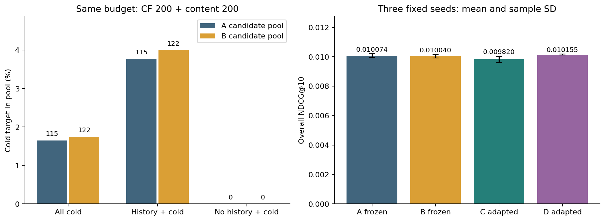

# EvoRec 整体架构与实现过程

编写日期：2026-09-22。内容基线：R06 实现提交 bf73ce7、结果提交 31a4116，以及对应的源代码、配置和实验归档。本次整理文档，没有新增模型训练或在线服务能力。

项目由 **Die4U23 发起并主导**：作者提出推荐研究目标和总体方向，决定研究范围、优先级和推进取舍；实现、测试及文档使用 AI 编程助手辅助。本文依据代码与证据说明已经完成的工作，不把目标架构写成已部署系统。

## 阅读导航

- [1. 项目解决什么问题](#1-项目解决什么问题)
- [2. 整体架构与完成边界](#2-整体架构与完成边界)
- [3. 代码结构与技术选择](#3-代码结构与技术选择)
- [4. 离线数据与算法链路](#4-离线数据与算法链路)
- [5. 推荐请求如何执行](#5-推荐请求如何执行)
- [6. 从 M0 到 R06 的实现过程](#6-从-m0-到-r06-的实现过程)
- [7. 模型版本与发布恢复设计](#7-模型版本与发布恢复设计)
- [8. 测试审计和版本管理](#8-测试审计和版本管理)
- [9. 如何运行和阅读代码](#9-如何运行和阅读代码)
- [10. 后续实现顺序](#10-后续实现顺序)

## 1. 项目解决什么问题

EvoRec 研究动态商品库中的推荐，核心问题是：**商品缺少训练交互时，怎样进入候选；进入候选之后，又怎样得到合理排序。**

以游戏商品为例，老商品可以从历史共同购买、评价等交互中获得协同信号。一个新游戏即使与用户偏好的类型相近，也可能因为没有出现在训练交互中，而无法被只依赖商品 ID 的模型输出。内容召回提供另一条入口：从标题和类别得到表示，再与用户过去喜欢的商品比较。

因此项目把推荐拆成两项任务：

1. **召回负责找到可能相关的商品。** 从较大的商品集合缩小到有限候选池，观察真实目标有没有入池。
2. **排序负责安排候选顺序。** 在已有候选中学习相关性，观察目标能否进入 Top10 或 Top20。

如果目标没有进入候选池，排序器无法将它排到前面。反过来，增加内容候选也不保证最终排名变好：它可能挤掉原有候选，或者与排序器的训练分布不一致。R03–R06 的迭代就是逐步拆解这两个问题。

本文中几个容易混淆的词有明确含义：

| 术语 | 本项目含义 |
| --- | --- |
| 正反馈 | 当前实验使用评分不低于 4 的事件 |
| 有历史请求 | 请求时间之前存在正反馈历史；不等于这个历史一定能被模型表示 |
| 已见商品 | 离线回放中，请求之前所有已交互商品；过滤集合不只包含正反馈 |
| 模型冷商品 | 未进入该方法所绑定训练交互集合的商品；不是“全平台无人见过” |
| 请求时可用 | 完整数据中的商品首次交互时间严格早于请求时间 |
| bundle | 目标服务架构中，可以共同加载的一组模型、编码器、映射及索引产物 |
| 已完成 | 有代码或实际运行证据；不自动意味着已接入线上业务 |

“首次交互”只是可用时间的代理，并非真实上架时间。商品标题与类别来自静态元数据，没有完整历史版本；当前实验明确保留这一限制。

## 2. 整体架构与完成边界

当前系统由 **离线研究链路** 和 **进程内服务演示** 两部分组成。离线链路已经完成采样、训练、推理、评价和结果审计；服务侧已经把会话、接收、排序、过滤和结果记录接成可调用 HTTP 闭环，但状态仅存在内存，排序仅使用确定性的演示热门分数，还没有连接真实数据库和模型运行时。

### 2.1 系统全景

~~~mermaid
flowchart TB
  subgraph Offline["离线研究：已实现并完成 R01–R06 运行"]
    Data["原始交互和静态元数据"] --> Protocol["采样、时间协议、输入指纹"]
    Protocol --> Features["协同统计与内容表示"]
    Features --> Recall["合法候选召回与融合"]
    Recall --> Rank["基线排序和神经排序"]
    Rank --> Select["验证选型、冻结检查点、测试"]
    Select --> Audit["候选及模型重放、分组指标、统计区间"]
    Audit --> Report["汇总报告、图表和验证记录"]
    Select --> Files["本地检查点、编码器、映射"]
  end
  subgraph Skeleton["进程内服务演示：已实现代码"]
    API["FastAPI 状态、会话与推荐接口"]
    UseCase["Recommend 应用用例"]
    Rules["不可变快照、绑定校验、过滤与稳定排序"]
    Memory["进程内会话、接收、热门排序与结果记录"]
    API --> UseCase
    UseCase --> Rules
    Memory --> UseCase
  end
  subgraph Planned["业务运行组件：待实现"]
    Export["bundle 导出与兼容性校验"]
    Runtime["模型运行时与有限队列"]
    DB["PostgreSQL 业务持久化"]
    Publish["后台构建、发布与恢复"]
    Web["推荐与管理页面"]
  end
  Files -. "待接入" .-> Export
  Export -. "待接入" .-> Runtime
  UseCase -. "排序接口待适配" .-> Runtime
  UseCase -. "接收与记录接口待适配" .-> DB
  Publish -. "版本发布" .-> Runtime
  Publish -. "持久状态" .-> DB
  Web -. "业务 HTTP 路由待注册" .-> UseCase
~~~

图中虚线表示设计中的连接。推荐接口已经调用 `Recommend` 业务用例；未配置数据库时使用进程内后端，配置 `EVOREC_DATABASE_URL` 后会话、请求和结果进入 PostgreSQL。真实模型推理仍未加载，训练继续通过独立研究入口运行。

### 2.2 当前可以演示什么

| 能力 | 当前状态 | 依据 |
| --- | --- | --- |
| 进程存活、业务就绪和能力查询 | 已实现 | [API 入口](../src/evorec/api/app.py) |
| 推荐输入、反馈和商品批次契约 | 已实现字段校验 | [contracts.py](../src/evorec/contracts.py) |
| 推荐编排与异常规则 | 已实现，使用测试适配器验证 | [recommend.py](../src/evorec/application/recommend.py) |
| 数据采样、时间回放、统计基线 | 已实现并运行 | [研究工作区](../research/README.md) |
| 序列模型、内容双塔和候选内排序 | 已真实训练 | [阶段记录](STATUS.md) |
| 多兴趣召回、匹配重训练与结果审计 | R06 已完成 | [R06 报告](experiments/r06-multi-interest/report.md) |
| 会话与推荐业务 HTTP 接口 | 已实现可选 PostgreSQL 持久化 | 会话令牌、创建、查询、重置、推荐及结果位置落库 |
| 反馈业务 HTTP 接口 | 已实现 | 会话访问、来源核对、epoch 冲突、载荷哈希幂等与状态更新在 PostgreSQL 事务中完成 |
| PostgreSQL、任务领取、模型发布 | 核心迁移与推荐适配器已实现；任务和模型发布待实现 | [正式迁移](../db/migrations/0001_m1_core.sql)、[架构决策](architecture/decisions.md) |
| 前端、C++ 扩展、线上性能 | 尚未实现或验证 | [Web 规划](../web/README.md)、[C++ 边界](../cpp/README.md) |

`/api/v1/system` 中 `model_training=false` 表示在线服务没有训练能力，不表示项目没有离线神经模型。研究训练使用独立命令入口。

## 3. 代码结构与技术选择

### 3.1 为什么使用分层的单仓库

个人项目同时包含算法实验和服务实现，先在一个仓库中明确职责，可以减少跨服务协调和发布成本。当前采用四层结构，外部依赖通过接口接入。

~~~mermaid
flowchart LR
  API["api / contracts：HTTP 与输入转换"] --> App["application：推荐用例和接口"]
  App --> Domain["domain：快照与推荐规则"]
  Infra["infrastructure：具体适配器"] --> App
  Infra --> Domain
  Boot["bootstrap：选择与组装对象"] --> App
  Boot --> Infra
  API -. "应用启动时" .-> Boot
~~~

这是依赖方向，不是已经部署的四个服务。将来接入独立推理进程，也可以继续保持同一份仓库和业务接口。

| 位置 | 当前职责 | 这样划分的原因 |
| --- | --- | --- |
| [domain/models.py](../src/evorec/domain/models.py) | 会话快照、商品快照、版本绑定、排序批次和结果 | 将一次请求的含义固定下来，避免模型或数据库细节侵入 |
| [domain/recommendation.py](../src/evorec/domain/recommendation.py) | 合法性过滤、去重、稳定 Top-K | 统一结果规则，避免不同模型各自解释业务约束 |
| [application/recommend.py](../src/evorec/application/recommend.py) | 调用接收、排序、保存接口并检查结果 | 把执行顺序和失败处理放在一个可测试用例里 |
| [application/ports.py](../src/evorec/application/ports.py) | 会话、接收、排序、记录、就绪 Protocol 接口 | 用例不绑定具体数据库或模型实现 |
| [infrastructure/readiness.py](../src/evorec/infrastructure/readiness.py) | 返回尚未配置依赖的就绪状态 | 当前如实报告缺少数据库、模型和商品版本 |
| [infrastructure/memory.py](../src/evorec/infrastructure/memory.py) | 进程内会话、接收、热门排序与结果记录 | 验证端口闭环；重启丢失，不替代 PostgreSQL |
| [infrastructure/postgres.py](../src/evorec/infrastructure/postgres.py) | 持久化会话、请求快照、演示排序结果与就绪检查 | 在线操作在线程中使用短连接事务，兼容 Windows 事件循环 |
| [api/app.py](../src/evorec/api/app.py) | HTTP 状态接口和响应转换 | 对外协议与内部规则分离 |
| [bootstrap.py](../src/evorec/bootstrap.py) | 按环境选择内存或 PostgreSQL 后端并组装用例 | 在明确入口选择具体实现 |
| [research](../src/evorec/research) | 数据、算法、训练、离线预测与评估 | 独立于在线会话和业务数据库运行 |

离线与在线的规则目标一致，但目前是不同实现，不能声称已经统一调用同一套过滤代码。例如，离线协议维护所有历史交互的 `seen`；服务领域函数过滤传入的 `session.history` 和 `hidden_items`。未来适配器如何构造完整排除集合，需要契约一致性测试，不能直接把有限的正反馈序列当作全部历史。

### 3.2 技术栈的用途与取舍

| 技术 | 当前用途或状态 | 选择原因 |
| --- | --- | --- |
| Python 3.12 | 服务骨架、研究脚本、审计工具 | 能在相同项目中连接数据处理、模型训练和服务接口 |
| PyTorch | 序列模型、双塔、残差排序器及 GPU 推理 | 用统一张量和自动求导实现不同模型，便于冻结检查点与重放 |
| NumPy、scikit-learn | 特征缓存、TF-IDF、SVD 和统计计算 | 先建立清晰、可核查的内容基线 |
| FastAPI、Pydantic | 状态路由和外部输入契约 | 将字段错误与业务执行分开，导出明确接口定义 |
| pytest | 领域规则、训练协议、模型行为与文件卫生检查 | 让关键失败场景可以重复验证 |
| Matplotlib | 实验曲线、比较图与区间图 | 图表直接来自结果文件，提供 PNG 和 SVG |
| PostgreSQL | M11 核心迁移与会话/推荐适配器已在本机 18.6 实库验证 | 用事务、行锁和幂等键管理会话及推荐结果；反馈仍待接入 |
| C++20、CMake、pybind11 | 接入规划，暂无实现 | 等性能测量定位值得优化的模块，再承担批量处理或索引相关工作 |

当前没有 Faiss 接入，也没有自研 C++ 推荐内核。采用精确内容打分便于核对召回结果；未来加入近似索引，需要同时衡量速度、内存和召回损失。

服务环境 `.venv` 与研究环境 `.venv-research` 分开。服务锁文件现包含下一阶段 PostgreSQL 开发所需的 Psycopg binary/pool，研究侧新增合并开发锁和 service/database/research 三类自检入口。已记录的研究环境使用 Windows、Python 3.12、PyTorch 2.9.0+cu126 和 RTX 4060 Laptop GPU，当前目录仍复用了系统包；尚无全新目录或 Linux 复建证据。这些是已有运行环境记录，不代表任意机器都能直接复现。

## 4. 离线数据与算法链路

### 4.1 数据进入实验之前先固定协议

原始数据采用 Amazon Reviews 2023 的 Video Games 类别。R01 先用前缀样本跑通流程；R02 起完整扫描交互文件，按稳定用户哈希选择分组，保留选中用户的完整记录，并排除 R01 开发用户。

R06 使用新的 4 / 20 用户桶，得到 223,839 条交互、137,016 名用户，与 R01–R05 用户交集为零。**新桶用于验证和测试查询；排序训练仍使用 R03 用户的固定滚动窗口。** 新用户样本不等于把全部训练数据也换成新用户。

[采样入口](../src/evorec/research/sample.py)和[R06 数据准备](../src/evorec/research/r06_data.py)负责保存样本、数据清单、哈希与旧样本交集检查。商品和时间范围仍与旧实验重合，因此用户不重合不等于跨领域或跨时间独立泛化。

### 4.2 通过时间回放构造请求

[protocol.py](../src/evorec/research/protocol.py)按时间遍历事件。对于时间 t 的事件，先使用严格早于 t 的历史生成请求，再更新同一时间点的全部事件。

这样，同一时间戳的一条交互不会被另一条请求提前看到。正反馈序列最多保留 50 件用于表示；所有已交互商品另存 `seen` 用于过滤。商品首次出现时间必须严格早于请求时间，不能等于请求时间。

例如，用户在 t1 喜欢 A、在 t2 喜欢 B。预测 t2 的 B 时，只能使用 t1 的 A；B 是评价标签，不能被加入历史、候选特征或兴趣向量。`Query` 虽然携带 target 供评价使用，召回和特征构造必须保持对 target 独立，专项测试会替换标签验证这一点。

未召回、无历史、目标当时不可用等情况不会在主指标中悄悄删除。项目同时报告不同人群的分母，使“全部请求效果”和“冷且可用目标效果”有可辨别的含义。

### 4.3 三类召回能力如何建立

**统计与协同路径。** 从训练期交互构造热门和 ItemCF，再形成 CF-blend 基线。它为模型比较提供参考，也承担显式回退。具体实现见 [baselines.py](../src/evorec/research/baselines.py) 和 [training_baselines.py](../src/evorec/research/training_baselines.py)。

**序列路径。** R02 的 SASRec-style 模型使用商品嵌入、位置嵌入和带因果掩码的 Transformer，学习下一商品预测。输出空间受训练词表限制；未映射历史走回退。它已真实训练，但该轮结果没有超过统计基线，因此没有仅因模型更复杂就将其选为默认方法。实现见 [neural.py](../src/evorec/research/neural.py)。

**内容路径。** R03 从标题与类别构造 TF-IDF，再用 SVD 得到归一化的 128 维内容向量。用户表示是历史商品向量按事件位置衰减的加权和再归一化；衰减系数为 0.8。双塔模型在此基础上为用户和商品分别学习残差变换。实现见 [content.py](../src/evorec/research/content.py)。

R03 编码器按其训练协议拟合；R05 为滚动模拟冷商品任务重新限定到 2017 年前的正反馈商品文本拟合，实际 15,824 份文档，R06 冻结复用这套 R05 编码器。不能将两个阶段描述成始终复用同一个拟合范围。

内容编码只在规定训练语料上拟合，其他商品文本使用已冻结变换。这样可以表示训练交互之外的商品，但不消除静态元数据缺少历史版本这一假设。

### 4.4 R06 如何表示多个兴趣

均值向量把历史合成一个方向。若用户同时喜欢赛车和策略游戏，平均后的方向可能无法准确表达任一兴趣。R06 用最近 8 个正反馈事件分别打分，再取最大的衰减相似度：

~~~text
multi_score(u, i) = max_j [0.9^j × max(cos(v_history[j], v_i), 0)]
j = 0 表示最近一次事件
~~~

缺失商品向量时，该事件不提供有效相似度，但不会把后面历史的距离提前。排序只使用当时已知的历史；先过滤已见、尚不可用和无有效表示的商品，再用稳定顺序处理同分。

均值召回和多兴趣召回各取 Top200，经过等权 RRF 融合，最终仍压回 **一个内容 Top200**；再与 CF Top200 求去重并集，最多 400 件。多兴趣没有额外获得最终候选配额，但会多做内容计算。

该实现是基于近期历史向量的确定性多兴趣召回，并非已经训练了 MIND、ComiRec 或生成式推荐模型。代码见 [multi_interest.py](../src/evorec/research/multi_interest.py)。

### 4.5 排序器在候选池里学什么

R05/R06 的排序器没有可训练的商品 ID 嵌入。用户向量 u 与商品向量 v 各 128 维，输入由下列部分组成：

~~~text
x = concat(u, v, u*v, |u-v|, 8 个标量)
维度 = 4 × 128 + 8 = 520
MLP = 520 → 128 → 64 → 1
~~~

8 个标量是内容余弦、协同名次变换、内容名次变换、训练热门强度、模型冷标记、商品年龄、历史长度和历史内容一致性。它们必须在请求时可获得，目标标签不进入特征。

最终分数由固定融合基础分和有界残差组成：

~~~text
cf_feature = 61 / (60 + CF_rank)，未进入该路时为 0
content_feature = 61 / (60 + content_rank)，未进入该路时为 0
base = 8 × 0.5 × (cf_feature + content_feature)
score = base + 4 × tanh(MLP(x))
~~~

最后一层初始化为零，使初始排序从基础融合开始。没有可表示历史时，预测明确保持基础融合；padding 用无效掩码排除。代码见 [ranker.py](../src/evorec/research/ranker.py)。

训练采用候选内单正目标交叉熵。冷加权版本将模拟冷目标权重设为 4，其余为 1，每批按权重总和归一化。未观测候选只是训练中的对比项，不能解释成用户明确不喜欢。

滚动训练的两个窗口分别是 2017–2019 和 2020–2021：召回统计只从各窗口之前的数据拟合，在窗口内部形成下一商品任务。没有真实进入候选池的目标不被强行插入；它不形成这次排序损失，但召回失败仍记录，评价分母保留。

### 4.6 为什么 R06 要比较四条路径

| 路径 | 内容候选 | 排序器 | 回答的问题 |
| --- | --- | --- | --- |
| A | 均值 | 冻结 R05 冷加权模型 | 原路径表现如何 |
| B | 均值＋多兴趣 | 与 A 完全相同的检查点 | 固定排序器时，改变召回发生什么 |
| C | 与 B 相同 | 在新候选上重新训练 | 排序器能否适应新候选 |
| D | 与 A 相同 | 同阶段重新训练 | 排除“只是重新训练与选轮”这一解释 |

A/B 检查点在旧 R05 验证集选轮，C/D 在 R06 验证集选轮。因此 C-B 同时包含再训练和重新选轮的影响；C-D 是两边都重新训练的匹配对照。另有 CF-blend、A-RRF、B-RRF，总计 15 种测试方法。

每个模型先按验证整体 NDCG 选择轮次。方法选型只使用 seed 17 与三个基线，先满足相对验证参考值 97% 的整体质量下限，再比较冷 Recall@20，并按整体 NDCG 和预登记顺序破同分。所有选型与检查点落盘后才开放测试。

## 5. 推荐请求如何执行

这部分解释已实现的应用用例。图中的接收和记录已有 PostgreSQL 持久化适配器；排序当前仍是明确标记的演示热门路径，尚未形成真实模型在线闭环。

~~~mermaid
sequenceDiagram
  participant Caller as 调用方
  participant UC as Recommend
  participant A as AdmissionPort
  participant R as RankingPort
  participant Save as ResultRecorderPort
  Caller->>UC: command：会话、期望历史版本、策略、K、超时
  UC->>A: acquire(command)
  A-->>UC: 固定上下文和租约
  UC->>UC: 核对请求、会话、历史版本
  UC->>R: rank(context, command)
  R-->>UC: 绑定、实际策略、候选、回退原因
  UC->>UC: 核对全部绑定，过滤、去重、稳定 Top-K
  UC->>Save: save(result)
  Save-->>UC: 保存成功
  UC->>A: 退出上下文，释放本地租约
  UC-->>Caller: 返回结果
~~~

### 5.1 快照让一次请求有确定含义

`RequestBinding` 绑定 request_id、session_id、session_epoch、history_version、bundle_id 和 exclusion_version。推理返回的绑定必须与接收时完全一致，防止历史与模型版本被混用。

例如，接收时历史版本为 7、模型为 B1；推理返回历史版本 8 或模型 B2 的结果，用例会拒绝。若用户在接收后又产生反馈，已接收请求仍使用自己的旧快照；未来真实适配器需要保证该快照来自正确事务边界。

冻结的数据类、tuple 与 frozenset 防止对象在请求内部被误改，但它们不自动保证数据库快照一致性。

### 5.2 后处理与失败行为

统一后处理过滤不合法、历史与屏蔽商品，重复商品保留最高分；同分商品按 ID 排序，同商品同分按来源名确定选择。候选不足时返回实际数量，不复制商品凑满 K。服务命令的 K 范围是 1–50；离线研究最多输出 200 件用于评价，两者属于不同接口约定。

示意：候选 A:0.8、A:0.6、B:0.8，以及不在合法集合中的 C:0.9，结果只保留 A、B。该例用于解释规则，不是实验数据。

固定策略发生回退时必须返回原因；adaptive 必须返回实际执行的具体策略。枚举里存在 GENERATIVE 或 ADAPTIVE，不代表对应算法已经实现。

结果保存失败不能返回推荐成功，模型故障不能伪装成正常空结果。`asyncio.timeout` 包围整个用例，测试证明的是可协作取消和本地上下文退出；远端 GPU 工作是否结束，需要未来运行时单独确认，不能据 HTTP 超时直接卸载模型。

相关失败场景见 [test_recommendation.py](../tests/test_recommendation.py)。在线业务还需接入身份、事务、远端资源管理和 HTTP 错误映射。

## 6. 从 M0 到 R06 的实现过程

实现过程按“提出问题、建立比较、观察结果、决定下一步”推进。不同阶段使用不同用户样本，不能把各轮指标直接串成一条持续上涨曲线。

| 阶段 | 实现工作 | 实际发现与推进原因 |
| --- | --- | --- |
| M0 | 输入契约、状态 API、四层代码、快照绑定与推荐用例测试 | 先固定接口与失败行为，为算法接入留出边界 |
| M1 内存切片 | 会话创建/查询/重置、推荐 HTTP、进程内接收/排序/记录适配器 | 先验证完整调用链和错误映射；不把易失状态计为持久化完成 |
| R01 | 前缀数据、热门、ItemCF、时间回放与基础审计 | ItemCF 未超过热门参照；前缀采样与历史截断需要改善 |
| R02 | 完整扫描与用户哈希采样、SASRec-style GPU 训练、早停与多种子 | 神经序列模型未超过 CF-blend，训练词表之外的冷商品没有入口 |
| R03 | 标题/类别表示、内容双塔、协同与内容融合 | 内容打通冷商品入口；整体排序改善与冷命中减少同时出现 |
| R04 | 冷候选保留、规则门控与失败位置诊断 | 验证集未支持替换固定融合，不能把手工规则当作必然提升 |
| R05 | 滚动模拟冷商品、520 维残差排序、普通与冷加权损失 | 学习排序提高了候选内转化，但冷目标入池仍少 |
| R05 复验 | seed 17 重放、补齐 29/43、48 项用户聚类区间 | 补充种子波动与统计不确定性；旧测试已经查看，不冒充新实验 |
| R06 | 近期多兴趣召回、A/B/C/D 消融、六次训练、全量重放与 50 项区间 | 候选覆盖略增，排名收益未获支持，保留验证选中的原路径 |

### 6.1 R05 为什么是一个转折

R05 开始把问题从“换一条召回路径”推进到“在合法候选内学习排序”。原实验中，RRF、普通排序 seed 17、冷加权排序 seed 17 的冷目标 Top20 命中分别为 6、11、26，分母同为 7,088。

但候选池只有 127 个冷目标可达。这个限制意味着：即使排序器能更好地利用候选，也无法解决绝大多数目标没有被召回的问题。因此下一步需要改变召回，并检查排序器能否适应，而不是只继续增加训练轮数。

证据：[R05 原始报告](experiments/r05-ranker/report.md)、[复验报告](experiments/r05-cold-replication/report.md)。

### 6.2 R06 的完整结果

R06 测试包含 12,524 个正反馈请求、9,373 名用户。C/D 三个种子各训练一次，共 6 次训练、74 轮；所有检查点重载验证通过。三个种子的整体 NDCG@10 为：

| 方法族 | 均值 ± 样本标准差 |
| --- | ---: |
| A：均值＋冻结排序 | 0.010074 ± 0.000129 |
| B：多兴趣融合＋冻结排序 | 0.010040 ± 0.000117 |
| C：多兴趣融合＋重训练排序 | 0.009820 ± 0.000216 |
| D：均值＋匹配重训练排序 | 0.010155 ± 0.000027 |

冷目标入池由 115 / 6,978 增至 122 / 6,978，即约 1.648% → 1.748%；无历史冷目标仍为 0 / 3,928。近期多兴趣依赖用户历史，当前并未解决这部分请求的冷商品入口。

B-A 整体 NDCG 差值的 95% 边际区间为 [−0.000260567, +0.000184014]；C-D 为 [−0.000686012, +0.000000421]。两者均跨过零，后者上界很小但仍为正。冷 Recall 对应区间也跨过零，因此当前证据不支持替换原路径，保留验证选中的 **A-frozen-s17**。

测试批次均值内容计算耗时 7.865 秒，新增多兴趣计算另耗时 12.469 秒。A/B 共享部分计算，这些是单次离线批处理记录，不能换算成线上 p95，也不能据此声称相同候选预算就是相同计算成本。

图来自已提交结果，来源及图片哈希见[图表清单](experiments/r06-multi-interest/figures/manifest.json)。完整方法、人群、训练曲线与区间见 [R06 报告](experiments/r06-multi-interest/report.md)。

### 6.3 如何看待这些结果

本项目保留未获支持的结果。R02 说明更复杂的模型未必优于匹配任务的统计基线；R03/R04 说明冷商品入池与最终曝光不是同一问题；R05 说明学习排序能利用候选信息；R06 则说明增加兴趣表达不自动转化为排名改善。

三种子的均值不是一个集成排序器。用户聚类区间条件于固定检查点，不包含训练随机性，也没有进行多重比较校正。所有指标均为离线证据，尚无真实业务 A/B 收益。

## 7. 模型版本与发布恢复设计

本节是未来服务接入的设计，尚未实现真实加载器、发布协调器和持久任务执行者。已有训练检查点和离线来源清单，不等于已经完成在线 bundle。

### 7.1 为什么需要一起发布模型和映射

一个模型文件不能单独说明怎样解释输入和输出。商品内部编号、向量维度、编码器、标量顺序、索引距离和候选策略必须兼容。若只换权重不换映射，代码可能正常运行，却把某个编号解释成另一个商品。

目标 bundle 至少需要记录身份、代码与数据来源、训练截止时间、模型/编码器/映射哈希、商品集合、向量维度和类型、索引参数、策略预算及验证结果。

计划校验顺序为：清单结构 → 受管路径与文件哈希 → 维度及类型兼容 → 受控加载 → 小样本输出一致性。当前 [load_ranker](../src/evorec/research/ranker.py) 已检查离线排序器的协议、特征指纹、标量顺序和模型配置，这可以作为后续兼容性契约的依据。

### 7.2 发布不等于修改一个活动指针

目标流程是先构建和校验候选，预加载运行时，再关闭新请求接收屏障；数据库提交活动版本后，确认运行时已对齐，最后恢复接收。旧版本等待引用租约归零后才允许卸载。

数据库已提交但运行时未激活时，应保持未就绪，按持久状态继续恢复；如果必须回到旧版，执行有记录的补偿发布。不能只把内存指针改回去就声称数据库事务已回滚。

下架版本独立于模型版本。回滚模型时仍使用当前下架集合，防止已下架商品随旧模型重新出现。当前设计以接收时刻为一致性边界：下架确认前的在途请求允许按旧快照完成。

### 7.3 任务与业务状态的持久化

PostgreSQL 计划保存会话、反馈、推荐请求及商品位置、任务、bundle 和发布操作。任务领取使用租约和领取代数，旧执行者失去资格后不能提交结果。长时间模型推理、索引构建放在短事务之外。

连接中断可能使提交结果不确定，恢复应按 request_id、event_id 或发布操作 ID 对账。幂等的重点是相同请求重试不会制造重复业务结果，而不是简单“再执行一次”。

具体取舍与待补字段见[系统架构](02-architecture.md)、[ADR](architecture/decisions.md)和[工程建议评审](09-engineering-follow-up.md)。

## 8. 测试审计和版本管理

### 8.1 三类证据各自证明什么

| 证据层 | 已做的工作 | 不代表什么 |
| --- | --- | --- |
| 单元与边界测试 | 快照不变、版本冲突、过滤回退、时间和标签隔离、候选预算、模型重载、文件卫生 | 不等于真实数据库和远端 GPU 取消通过 |
| 实验审计 | 重建候选来源、特征、模型输出和指标，核对训练/验证/测试与来源指纹 | 不等于跨机器、跨数据集或线上效果 |
| 交付检查 | 报告与原记录一致、图片哈希、资源链接、Git 暂存区范围 | 不等于所有浏览器显示及生产部署通过 |

R06 保存的验证记录为研究专项 47 项通过、服务与数据 108 项通过且 6 个依赖相关模块跳过。两套有 6 项协议检查重叠；12 项文件卫生测试已包含在服务套件中，不能简单相加为独立测试数。

R06 审计重建 45,382 条候选来源请求，重放 361,425 条排名记录，总计 138,921,354 次候选检查。最后一个数字是累计检查次数，不是商品数或用户数。50 项预登记用户聚类区间独立复算一致。

这些是 2026-09-17 归档的运行证据，本次文档整理没有重新训练或重跑全部模型。入口包括 [r06_analysis.py](../src/evorec/research/r06_analysis.py)、[区间复算工具](../scripts/verify_r06_intervals.py)和[产物检查记录](validation/r06-artifacts-checks.json)。

### 8.2 一次实验如何形成可追溯交付

1. 写明问题、数据、基线、预算、选型和统计方法，提交协议。
2. 完成实现和必要测试，提交训练源码，再开始正式训练。
3. 每次使用新运行目录，保存配置、输入哈希、代码提交、源文件快照、检查点和逐请求轨迹。
4. 先固定验证选型与模型，再开放测试；测试查看后不能继续将其称作未见留出。
5. 从完成记录生成报告、图表和审计结果，结果单独提交。
6. 只暂存指定文件，检查 Git 中实际内容和链接，推送后比对远程提交号。

R06 对应的提交为：协议 `a2e098d`、文件卫生 `a8ab1af`、实现 `bf73ce7`、工程建议评审 `7478310`、结果交付 `31a4116`。保留它们是为了追踪“哪个版本产生哪个实验”，不通过后补日期制造开发经历。

### 8.3 文件如何保存

| 内容 | 保存位置 | Git 状态 |
| --- | --- | --- |
| 源码、配置、测试 | src、research、tests | 跟踪 |
| 架构、协议、汇总结果、图表、检查证据 | docs、scripts | 跟踪 |
| 原始数据和采样 | datasets | 本地忽略 |
| 模型、特征缓存、用户级轨迹、源码快照 | artifacts | 本地忽略 |
| 临时日志与测试工作目录 | tmp | 本地忽略 |
| 博客与实习材料 | 指定本地路径 | 本地保留，不纳入发布 |

当前仓库不携带训练所需的全部大文件，首次 clone 后必须准备相同数据与环境。不同分支可能仍存在历史跟踪路径，切换前应确认不会覆盖本地材料。具体约定见[仓库范围与版本约定](08-repository-policy.md)。

## 9. 如何运行和阅读代码

### 9.1 启动当前可运行服务

在项目根目录且服务环境已经安装的前提下：

~~~powershell
.\.venv\Scripts\python.exe -m uvicorn evorec.api.app:app --host 127.0.0.1 --port 8000
~~~

`GET /health/live` 返回进程存活；`GET /health/ready` 默认返回 503 并列出真实数据库、模型运行时和活动商品版本阻塞项；`GET /api/v1/system` 将进程内推荐演示标为可用、持久化标为不可用。`POST /api/v1/sessions` 可创建演示会话，`POST /api/v1/recommendations` 会执行完整应用用例；未加载的固定策略会带原因回退到热门路径。首次环境安装与调用边界见 [README](../README.md)。

### 9.2 查看和复建研究结果

最快的阅读入口是 [R06 HTML 报告](experiments/r06-multi-interest/report.html)，其中包括训练曲线、候选覆盖、排序指标和统计区间。模型与本地轨迹已准备好时，可以按 [R06 指南](../research/R06-multi-interest-guide.md)进行审计或重建报告。

重新训练必须使用新输出目录，并为新的展示结果指定独立 report_directory。不要覆盖已归档结果。R06 固定验收脚本对原分支名称和原运行计数有检查，不能直接在本文档分支上把它当作通用实验验收工具。

### 9.3 推荐的代码阅读顺序

| 阅读目的 | 顺序 |
| --- | --- |
| 理解数据是否可靠 | sample.py → protocol.py → test_training_protocol.py |
| 理解内容表示和冷商品入口 | content.py → multi_interest.py → test_multi_interest.py |
| 理解排序训练 | ranker.py → ranker_data.py → run_multi_interest.py |
| 理解结论如何验证 | r06_analysis.py → verify_r06_intervals.py → results.json |
| 理解服务如何接入算法 | domain/models.py → domain/recommendation.py → application/ports.py → application/recommend.py → bootstrap.py |

源文件集中在 [research](../src/evorec/research) 与 [服务源码](../src/evorec)，测试集中在 [tests](../tests)。先理解请求与候选的输入输出，再阅读训练循环，比只从模型层数开始更容易把握整个项目。

## 10. 后续实现顺序

**研究方向：** 先诊断无历史冷目标为什么不可达、额外召回的候选为何没有形成稳定排名收益，再登记后续方法和留出协议。更强文本表示、不同兴趣学习或新召回策略都需要匹配基线与成本比较；本轮没有这些方法的已完成结果。

**工程方向：** 按以下依赖顺序补齐可运行闭环，每阶段形成实现、验证和提交记录。

| 阶段 | 交付物 | 完成条件 |
| --- | --- | --- |
| M11/M12 | PostgreSQL 会话、接收、结果、反馈幂等及完成结果内容对账已完成 | 真实数据库中的反馈重放、相同结果重试和不同结果拒绝已通过；客户端推荐幂等键仍待单独设计 |
| M21/M22 | bundle 校验工具、持久发布状态与恢复 | 错配产物拒绝；各持久化边界中断后可以恢复；过期执行者无法提交 |
| 模型接入与展示 | 真实排序适配器、有限队列、前端最小推荐体验 | 请求能定位到模型/商品版本，回退与故障可解释 |
| O01/V01 | 实机性能测量和必要优化 | 固定请求分布测量排队、检索、排序、保存与端到端耗时 |
| C++ 扩展 | 被测量证明有必要的局部模块 | 与参考实现语义一致，并提供耗时与内存的前后对照 |

本阶段形成的是有实验依据的推荐研究链路与服务接入基础。下一步的工程价值，在于让已验证的算法按照明确的请求、产物和恢复规则运行起来，同时继续保留真实结果与能力边界。

---

参考入口：[系统架构细则](02-architecture.md) · [架构决策](architecture/decisions.md) · [当前进度](STATUS.md) · [研究工作区](../research/README.md) · [R06 协议](experiments/r06-multi-interest-protocol.md) · [R06 完整报告](experiments/r06-multi-interest/report.md)
