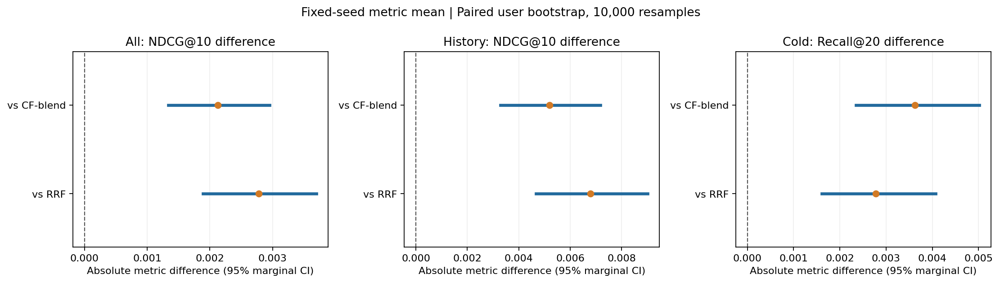

# 冷加权复验配图

图片来自实际完成的训练与用户聚类分析；[来源清单](manifest.json)。

[训练曲线 SVG](learning-curves.svg)

[区间 SVG](paired-intervals.svg)

区间是固定检查点条件下的 95% 边际区间，未做多重比较校正；三种子指标平均不是集成排序结果。

[完整报告](../../../../experiments/r05-cold-replication/report.md)
