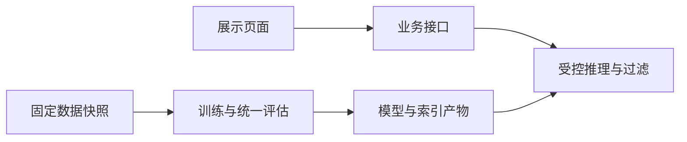

# 从零构建 EvoRec：一个推荐算法项目的持续实践记录

创建：2026-09-14｜最近更新：2026-09-15｜当前阶段：M0 工程框架与分层架构

我是一名大学生，目前主要使用 C++，也了解一些 Python。为了更深入地学习推荐算法，我开始构建 EvoRec：一个围绕动态商品库展开的推荐研究与演示项目。

这篇文章会随着项目一起更新，记录问题如何被拆解、方案为什么这样选择、实现遇到了什么困难，以及实验最终说明了什么。现在项目已经建立工程框架与分层架构，接下来要进入数据与基线验证。

## 项目进度

| 阶段 | 当前状态 | 已有结果或下一步 |
| --- | --- | --- |
| 需求与技术方案 | 已完成初版 | PRD、技术栈选型和项目交付框架 |
| M0 工程框架与架构 | 已完成 | 最小 API、输入契约、推荐用例与分层边界；55 项自动检查 |
| 数据与基线验证 | 下一阶段 | 确定数据子集，跑通小规模实验 |
| 推荐算法与研究实验 | 计划中 | 强基线、生成式检索、动态商品与预算路由 |
| 产品功能与前端 | 计划中 | 推荐体验、商品工作台、策略对比与看板 |
| 性能优化与最终展示 | 计划中 | 性能分析、按需 C++ 扩展和完整验收 |

## 一、为什么开始这个项目

最初考虑项目时，我更倾向于发挥 C++ 的优势，做搜索或推荐相关的工程实践。进一步梳理目标后，我发现自己更想理解推荐算法本身：用户兴趣如何表示，候选商品如何产生，模型为什么把某件商品排在前面，以及一个看起来合理的改动是否真的有效。

这些问题需要一套能够反复实验、检查和解释结果的工作流程。我希望通过 EvoRec，把阅读方法、实现基线、设计实验和构建演示系统连接起来。

选题最终落在了“动态商品库”上。商品推荐中的供给会发生变化：新商品加入，旧商品下架，用户也会产生新的行为。这给我提供了一个具体的切入点：**模型没有见过的新商品，如何进入推荐候选？为不同请求分配不同计算量，能否改善效果与成本的关系？**

目前我还没有这两个问题的实验答案。它们是接下来要验证的研究假设，也决定了这个项目需要怎样的数据、模型与工程结构。

## 二、EvoRec 要解决什么问题

可以先设想一个场景：某位用户最近一直浏览合作类游戏，商品库中新加入了一款相关游戏。系统已经拿到它的标题、类别和介绍，但它还没有积累多少行为数据。

这时至少要分别回答三个问题：商品是否已经发布并允许推荐；现有检索方法能否找到它；它与其他候选一起排序时，能否进入最终列表。

这三个问题对应不同层次。发布状态属于业务流程，候选可达性涉及表示与检索，最终名次取决于模型和排序。把它们区分开，后续遇到“新品没有被推荐”的现象时，才能沿着链路定位原因。

EvoRec 的目标产品形态是一套 Web 演示系统，包含四部分：推荐体验页、商品工作台、策略对比页和效果看板。浏览者可以选择示例用户、查看推荐并提交反馈；运营者可以导入和发布新品；算法结果能够按相同输入进行比较。

我把完成标准分成三个方面。功能上，要能走通真实的操作流程；实验上，要有统一协议和可靠基线；展示上，要能找到每个结果对应的数据、配置与版本。具体范围已经整理在 [产品需求文档](../../EvoRec_展示版PRD.md) 中。

## 三、从想法到技术方案

### 先明确每一层负责什么

项目需要同时处理离线研究和在线体验。我将它们组织成两条链路：



这是目标架构，当前实现了业务接口外壳、输入契约，以及尚未接入真实模型的推荐应用用例。

离线部分负责产生样本、训练模型和评价方法；在线部分负责接收请求、读取会话状态、执行推荐并保存反馈。模型与索引通过版本化产物连接两个部分，便于后续追溯结果和处理发布。

### 技术选择围绕工作内容展开

| 技术 | 在 EvoRec 中的职责 | 本次选择的主要考虑 |
| --- | --- | --- |
| Python、PyTorch | 算法训练、推理与评价 | 方便沿用参考实现并修改实验逻辑 |
| Sentence Transformers、Faiss | 商品内容表示与候选检索 | 为内容路径和新品可达性实验提供工具 |
| Parquet、DuckDB | 离线数据快照和统计 | 让切分规则和重复分析可以独立维护 |
| FastAPI、Pydantic | 服务接口与输入契约 | 让参数、返回结构和错误边界明确 |
| PostgreSQL | 会话、事件、任务和发布状态 | 集中管理持久数据与事务关系 |
| React、TypeScript | 交互页面 | 呈现完整操作流程及真实状态 |
| C++、pybind11 | 条件满足后的局部扩展 | 在性能分析确认瓶颈后再决定投入 |

虽然我的主要语言是 C++，这个项目的算法主体仍然选择 Python。这样可以先把数据处理、模型修改和实验评价接起来。C++ 的位置则保留给有明确输入输出、可以测量收益的模块。

例如，候选过滤或语义编码前缀查询可能成为优化对象，但这取决于实际测量。如果瓶颈主要在其他地方，我就需要调整优化方向。这项决定将在性能阶段重新评估。

完整的替代方案比较和使用边界放在 [技术栈选型报告](../../EvoRec_技术栈选型报告.md)。这篇实录主要记录那些对实际推进产生影响的决策。

## 四、第一阶段：建立工程框架

### 当前工程如何组织

第一阶段把需求、设计、研究和验收材料连接起来，并建立能够继续接入业务的代码骨架。主要目录如下：

```text
docs/                   架构、数据、接口、研究协议与验证记录
src/evorec/api/          最小服务接口
src/evorec/domain/       不可变快照、候选合法性规则
src/evorec/application/  推荐用例、依赖接口和就绪查询
src/evorec/infrastructure/ 外部依赖适配器
src/evorec/bootstrap.py  依赖组装入口
src/evorec/contracts.py  共享输入契约
tests/                  契约与服务边界检查
db/                     数据库设计草案
research/               研究规划和实验配置模板
web/                    前端页面规划
cpp/                    性能扩展的接入条件
```

这里的目录代表不同职责，并不意味着所有模块已经实现。当前的 `research/`、`web/` 和 `cpp/` 主要保存规划，数据库结构也还没有在实际数据库上执行。

### 一个小例子：程序启动了，推荐服务就可用了吗

当前最小 API 有三个接口：

| 接口 | 当前行为 |
| --- | --- |
| `/health/live` | 返回 200，表示 API 进程存活 |
| `/health/ready` | 返回 503，说明推荐业务尚未就绪 |
| `/api/v1/system` | 返回阶段、版本和已接入能力 |

业务就绪接口当前返回的内容是：

```json
{
  "ready": false,
  "blockers": [
    "database_not_connected",
    "model_runtime_not_loaded",
    "catalog_bundle_not_loaded"
  ]
}
```

这是当前框架的预期行为。接口外壳可以处理状态请求，数据库、模型和商品库却还没有连接。将两种状态分开后，后续的启动检查才能回答一个更具体的问题：这个进程现在究竟能够做什么？

相关实现见 [最小 API](../../src/evorec/api/app.py)。这些响应已经通过进程内请求检查，尚未进行真实网络负载测试。

### 输入契约为什么要提前定义

另一个例子是用户屏蔽商品。假设网络不稳定，同一次操作被提交了两次。如果接口语义是“切换屏蔽状态”，第二次提交可能把第一次的结果反转。

因此，当前设计采用显式状态设置。下面只展示反馈中的两个字段，完整事件还需要携带事件、会话、请求、商品标识和带时区时间：

```json
{
  "kind": "hide_set",
  "desired_state": true
}
```

这个请求表达“希望商品处于屏蔽状态”。未来处理重试时，还需要使用事件 ID 和载荷内容检查幂等性，并在事务中更新会话。

当前输入契约已经检查显式布尔状态、未知字段和时间格式；持久化后的事件去重、并发处理和会话更新还要在后续阶段实现。定义请求结构，只完成了这一流程的一部分。

商品导入也采用同样的思路：先检查必填字段、批内重复 ID 和条数上限，再进入后续业务处理。契约层允许最多 1000 条商品，文件体积、已有商品冲突和发布结果需要各自验证。

### 第一批检查说明了什么

2026 年 9 月 14 日的验证记录中，Windows / Python 3.12.6 环境下有 **23 项自动检查通过，0 项失败**。检查覆盖了批内重复、1000 条边界、空字段、反馈显式状态、曝光条件、带时区时间，以及存活与就绪状态的区分。

这些结果证明当前契约与服务外壳符合已定义的边界。它们还不能说明推荐效果、数据库事务正确性、模型发布安全性或实际吞吐能力。

我把验证范围和未完成事项一起保存在 [项目状态记录](../STATUS.md) 中。后续每个阶段都会补充相应证据，让“已经完成”的描述能对应到实际检查。

### 架构细化：一次推荐究竟属于哪个版本

2026 年 9 月 15 日，我继续把框架落实到代码。遇到的第一个设计问题是：如果推荐计算期间商品库发布了新版本，这个请求到底应该使用哪个版本？

设想请求开始时使用模型 A 和商品映射 A，检索过程中却切换到映射 B。即使两份文件分别都能加载，返回的内部编号也可能被解释成另一件商品。因此，我把模型、编码器、映射和索引组织成一个 bundle；请求接收时固定 bundle ID，后面的步骤都携带这个标识。

仅有模型版本还不够。用户历史、会话重置和商品下架也会改变结果是否合法。当前代码把请求 ID、会话 ID、epoch、历史版本、bundle ID 和下架版本组成 RequestBinding。排序返回之后，应用层逐项核对这六个字段，任何一个不一致都不能保存为正常结果。

这并不意味着数据库与模型版本切换已经实现。现在完成的是领域对象和应用层检查；如何获得一致快照、怎样在发布时暂停新请求接收，以及崩溃后如何恢复，已经写成后续适配器必须遵守的协议。

### 分层怎样帮助我继续实现算法

当前代码分为领域、应用、适配器和接口四层。领域层保存不依赖 Web 框架的规则，例如过滤已交互、已屏蔽或不合法商品；应用层组织“取得快照、执行策略、核对结果、保存后返回”。模型和数据库通过接口接入。

例如，两条召回路径都返回商品 A，应用层最终只保留一条；合法候选只有两件时，请求十件也不会重复填满。生成概率和向量相似度需要先在排序适配器中完成明确的融合，再交给统一后处理。未来替换算法实现时，这些公共规则可以继续使用。

同样，用户选择 dense 却实际执行 popular 时，结果必须保留真实路径和回退原因。adaptive 则需要记录最终选择了哪条路径。这个约定会影响后续成本统计，否则看板展示的“策略耗时”可能与实际计算不一致。

此次检查总计 **55 项通过**，新增覆盖版本串用、历史冲突、过滤与去重、超时释放、保存失败和分层依赖等边界。推荐流程中的模型与数据库使用测试替身；当前公开 API 仍只有状态接口。这些检查帮助固定应用层行为，真实并发发布与算法效果还要分别验证。

完整模块图、请求时序、发布故障表和实现顺序放在 [系统架构](../02-architecture.md)，取舍理由放在 [架构决策记录](../architecture/decisions.md)。下一步需要用真实数据跑通基线，再把模型适配器接到这条流程中。

## 五、第二阶段：准备数据与建立基线

**计划中。** 下一步先确认设备和数据子集，跑通一次小规模基线实验，记录样本数、时间范围、训练耗时与资源使用，再完善统一评价入口。

这一节将重点记录数据清洗、时间切分和泄漏检查。“模型训练时没有见过”和“刚刚进入商品库”会分别定义，首次交互时间作为商品可用时间代理时的限制也会写清楚。

## 六、第三阶段：理解与实现推荐方法

**计划中。** 从能够解释和检查的基线开始，逐步接入内容检索、序列推荐和生成式方法。每个方法按“问题、原理、小例子、实现、验证”的顺序记录。

阅读参考实现时，会区分直接复现的部分与为统一协议做出的修改。生成式与稠密检索的组合已有相关研究，我需要进一步明确自己验证的是哪一个具体问题。

## 七、第四阶段：用实验检验想法

**计划中。** 记录整体、模型冷物品和低频物品表现，比较候选质量、最终排序与计算成本，并用消融实验检查各模块的作用。

结果表会注明数据、配置、样本数和测量条件。预算路由的成本需要覆盖用于决策的计算；出现没有提升或退化的结果时，也会保留分析，而不是只展示最好的运行。

## 八、第五阶段：把算法接入可操作的系统

**计划中。** 依次完成推荐请求、会话反馈、商品导入与发布，再接入策略对比和效果看板。

这一节重点解释一次操作如何经过各模块，如何保持模型、映射与索引版本一致，以及任务失败、迟到事件、下架和回滚如何处理。页面截图在真实功能完成后加入。

## 九、第六阶段：性能分析与 C++ 优化

**计划中。** 先测量排队、模型、检索与后处理的耗时，再判断是否值得引入 C++ 扩展。

若实施优化，会记录选择原因、接口设计、数据所有权、正确性对照和端到端收益。如果没有值得迁移的瓶颈，这一节就记录测量结果和保留现有实现的理由。

## 十、最终展示与阶段复盘

**计划中。** 整理最终交付范围、启动步骤、演示流程和研究结论，并回顾哪些决策有效、哪些设计需要重做。

展示时，功能、算法质量和服务性能分别提供证据。当前尚没有模型效果或性能提升数据，后续会随实际验收补充。

## 十一、持续更新日志

更新日志按时间倒序追加。正文维护当前认识；如果后续证据改变旧结论，会保留修正日期和原因。

### 2026-09-15｜建立分层架构与推荐用例

**本次问题：** 明确一次推荐的状态归属，让模型、数据库与接口可以沿着稳定边界继续实现。

**实际改动：** 建立四层代码、请求快照、推荐用例和就绪依赖组装；补充版本发布、下架、后台任务和崩溃恢复设计，记录六项架构决策。

**验证过程：** 运行完整自动检查，核对依赖和导出契约；检查文档链接。模型和存储使用仅用于测试的替身，公开推荐接口仍未注册。

**结果与证据：** 55 项自动检查通过，0 失败；4 份契约重新导出。见 [本次验证记录](../validation/architecture-checks.json) 与 [测试报告](../validation/architecture-tests.xml)。

**当前结论：** 已有可检查的应用用例，数据库事务、模型推理、发布协调和前端仍需后续接入。

**下一步：** 推进 R01 数据与基线验证，并按 M11 的设计补齐实际数据库迁移。

### 2026-09-14｜建立 M0 框架与项目实录

**本次问题：** 将项目想法整理为能逐步执行和检查的工作，并为后续持续记录建立入口。

**实际改动：** 完成需求、选型与交付框架，建立最小服务和共享输入契约；初始化本篇实录，写明当前进度与后续章节。

**验证过程：** 工程阶段执行契约与进程内 API 检查；博客初始化时核对代码、项目状态及已有测试记录。文章中的测试数字引用工程阶段记录，本次文稿编辑没有重新运行服务测试。

**结果与证据：** 工程记录为 23 项检查通过；当前仍没有数据库连接、模型和前端。细节见 [验证记录](../STATUS.md)。

**当前结论：** 项目已经具备继续开展数据与基线验证的框架。下一次需要获得一份真实的小规模实验记录，才能决定数据规模和后续配置。

**下一步：** 执行 R01，确认设备与数据子集，跑通第一条基线链路。

## 相关资料

- [项目入口与运行说明](../../README.md)
- [产品需求文档](../../EvoRec_展示版PRD.md)
- [技术栈选型报告](../../EvoRec_技术栈选型报告.md)
- [总体架构](../02-architecture.md)
- [研究协议草案](../05-research-protocol.md)
- [任务与需求追踪](../06-delivery-plan.md)
- [项目状态与验证记录](../STATUS.md)
