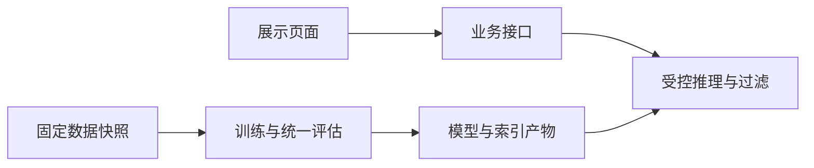
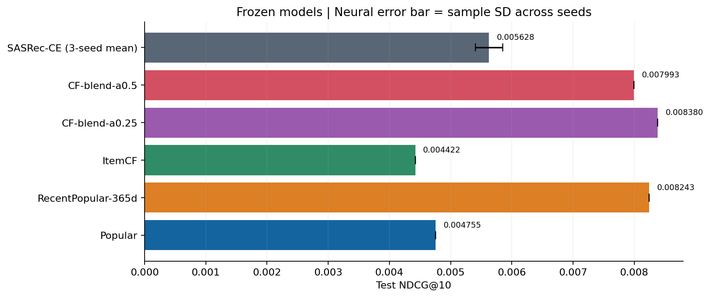
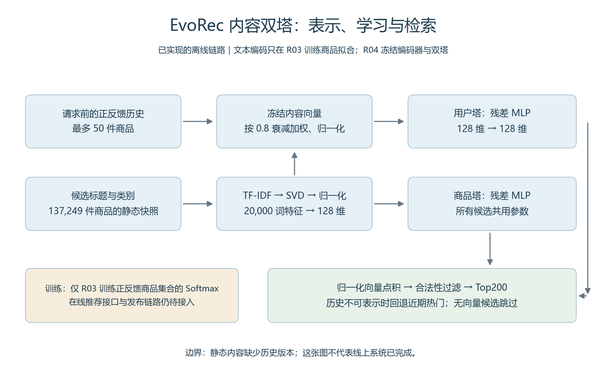
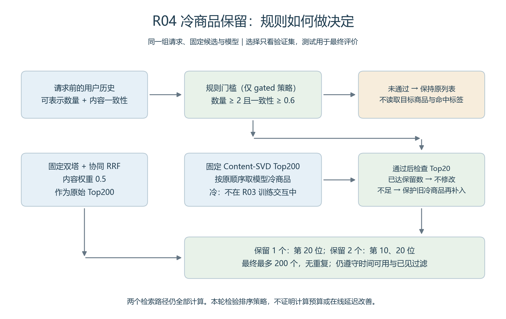
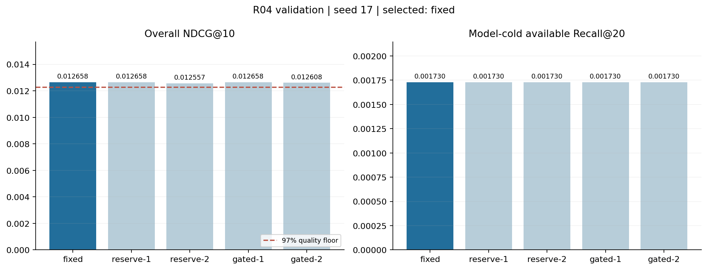
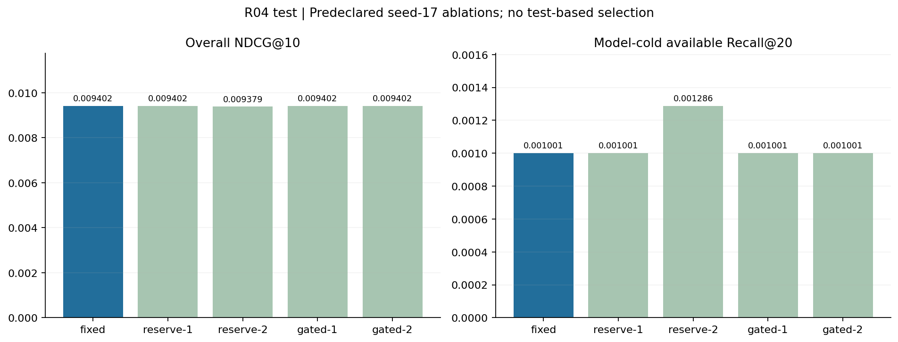
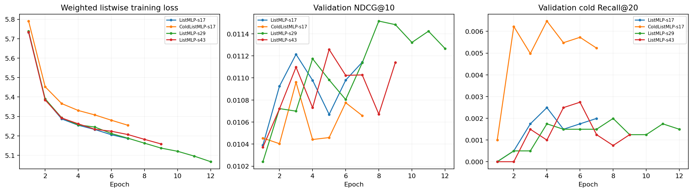
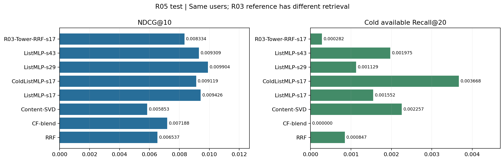

# 从零构建 EvoRec：一个推荐算法项目的持续实践记录

创建：2026-09-14｜最近更新：2026-09-16｜当前阶段：R05 新排序模型完成训练、测试与独立审计

我是一名大学生，目前主要使用 C++，也了解一些 Python。为了更深入地学习推荐算法，我开始构建 EvoRec：一个围绕动态商品库展开的推荐研究与演示项目。

这篇文章会随着项目一起更新，记录问题如何被拆解、方案为什么这样选择、实现遇到了什么困难，以及实验最终说明了什么。现在项目已经完成真实数据基线、序列训练与内容双塔，并通过持续报告记录模型的改进和取舍。最新一轮已完成冷商品保留与门控验证：增加曝光并没有自动换来相关性提升。

## 项目进度

| 阶段 | 当前状态 | 已有结果或下一步 |
| --- | --- | --- |
| 需求与技术方案 | 已完成初版 | PRD、技术栈选型和项目交付框架 |
| M0 工程框架与架构 | 已完成 | 最小 API、输入契约、推荐用例与分层边界；55 项自动检查 |
| 数据与基线验证 | R01 已完成 | 5 万交互、热门 / ItemCF、79 项检查 |
| 用户采样与首轮序列训练 | 已完成 | 226,172 条交互、39 轮训练、三种子统计、自动曲线 |
| 内容召回与双塔融合 | 已完成首轮验证 | 新用户样本 224,853 条、48 轮训练、整体与冷商品指标 |
| 冷商品保留与门控 | R04 已完成 | 冻结三组双塔；新用户实验；验证集保留原融合策略 |
| 神经候选排序 | R05 已完成首轮 | 3,851 个滚动训练样例、35 轮、普通 / 冷加权消融 |
| 后续算法研究 | 计划中 | 冷加权模型多种子复验、增强候选质量与预算路由 |
| 产品功能与前端 | 计划中 | 推荐体验、商品工作台、策略对比与看板 |
| 性能优化与最终展示 | 计划中 | 性能分析、按需 C++ 扩展和完整验收 |

## 一、为什么开始这个项目

最初考虑项目时，我更倾向于发挥 C++ 的优势，做搜索或推荐相关的工程实践。进一步梳理目标后，我发现自己更想理解推荐算法本身：用户兴趣如何表示，候选商品如何产生，模型为什么把某件商品排在前面，以及一个看起来合理的改动是否真的有效。

这些问题需要一套能够反复实验、检查和解释结果的工作流程。我希望通过 EvoRec，把阅读方法、实现基线、设计实验和构建演示系统连接起来。

选题最终落在了“动态商品库”上。商品推荐中的供给会发生变化：新商品加入，旧商品下架，用户也会产生新的行为。这给我提供了一个具体的切入点：**模型没有见过的新商品，如何进入推荐候选？为不同请求分配不同计算量，能否改善效果与成本的关系？**

目前内容路径已经证明冷商品可以进入候选，但整体排序与冷商品相关性之间仍有明显取舍。计算预算如何分配仍待实验，这两条问题会继续指导模型与工程迭代。

## 二、EvoRec 要解决什么问题

可以先设想一个场景：某位用户最近一直浏览合作类游戏，商品库中新加入了一款相关游戏。系统已经拿到它的标题、类别和介绍，但它还没有积累多少行为数据。

这时至少要分别回答三个问题：商品是否已经发布并允许推荐；现有检索方法能否找到它；它与其他候选一起排序时，能否进入最终列表。

这三个问题对应不同层次。发布状态属于业务流程，候选可达性涉及表示与检索，最终名次取决于模型和排序。把它们区分开，后续遇到“新品没有被推荐”的现象时，才能沿着链路定位原因。

EvoRec 的目标产品形态是一套 Web 演示系统，包含四部分：推荐体验页、商品工作台、策略对比页和效果看板。浏览者可以选择示例用户、查看推荐并提交反馈；运营者可以导入和发布新品；算法结果能够按相同输入进行比较。

我把完成标准分成三个方面。功能上，要能走通真实的操作流程；实验上，要有统一协议和可靠基线；展示上，要能找到每个结果对应的数据、配置与版本。具体范围已经整理在 [产品需求文档](../../EvoRec_展示版PRD.md) 中。

## 三、从想法到技术方案

### 先明确每一层负责什么

项目需要同时处理离线研究和在线体验。我将它们组织成两条链路：



这是目标架构，当前实现了业务接口外壳、输入契约，以及尚未接入真实模型的推荐应用用例。

离线部分负责产生样本、训练模型和评价方法；在线部分负责接收请求、读取会话状态、执行推荐并保存反馈。模型与索引通过版本化产物连接两个部分，便于后续追溯结果和处理发布。

### 技术选择围绕工作内容展开

| 技术 | 在 EvoRec 中的职责 | 本次选择的主要考虑 |
| --- | --- | --- |
| Python、PyTorch | 算法训练、推理与评价 | 方便沿用参考实现并修改实验逻辑 |
| TF-IDF / SVD、PyTorch 双塔 | 已实现的内容表示与精确检索 | 从训练商品学习文本表示，为冷商品建立入口 |
| Sentence Transformers、Faiss | 后续增强方案 | 预训练语义编码与近似索引尚未接入 |
| Parquet、DuckDB | 离线数据快照和统计 | 让切分规则和重复分析可以独立维护 |
| FastAPI、Pydantic | 服务接口与输入契约 | 让参数、返回结构和错误边界明确 |
| PostgreSQL | 会话、事件、任务和发布状态 | 集中管理持久数据与事务关系 |
| React、TypeScript | 交互页面 | 呈现完整操作流程及真实状态 |
| C++、pybind11 | 条件满足后的局部扩展 | 在性能分析确认瓶颈后再决定投入 |

虽然我的主要语言是 C++，这个项目的算法主体仍然选择 Python。这样可以先把数据处理、模型修改和实验评价接起来。C++ 的位置则保留给有明确输入输出、可以测量收益的模块。

例如，候选过滤或语义编码前缀查询可能成为优化对象，但这取决于实际测量。如果瓶颈主要在其他地方，我就需要调整优化方向。这项决定将在性能阶段重新评估。

完整的替代方案比较和使用边界放在 [技术栈选型报告](../../EvoRec_技术栈选型报告.md)。这篇实录主要记录那些对实际推进产生影响的决策。

## 四、第一阶段：建立工程框架

### 当前工程如何组织

第一阶段把需求、设计、研究和验收材料连接起来，并建立能够继续接入业务的代码骨架。主要目录如下：

```text
docs/                   架构、数据、接口、研究协议与验证记录
src/evorec/api/          最小服务接口
src/evorec/domain/       不可变快照、候选合法性规则
src/evorec/application/  推荐用例、依赖接口和就绪查询
src/evorec/infrastructure/ 外部依赖适配器
src/evorec/bootstrap.py  依赖组装入口
src/evorec/contracts.py  共享输入契约
tests/                  契约与服务边界检查
db/                     数据库设计草案
src/evorec/research/     数据、模型、候选策略与报告代码
research/               实验配置、依赖快照与运行指南
web/                    前端页面规划
cpp/                    性能扩展的接入条件
```

这里的目录代表不同职责，并不意味着所有模块已经实现。研究模块已经包含实际数据处理、训练与评价代码；web/ 和 cpp/ 仍主要保存规划，数据库结构也还没有在实际数据库上执行。

### 一个小例子：程序启动了，推荐服务就可用了吗

当前最小 API 有三个接口：

| 接口 | 当前行为 |
| --- | --- |
| `/health/live` | 返回 200，表示 API 进程存活 |
| `/health/ready` | 返回 503，说明推荐业务尚未就绪 |
| `/api/v1/system` | 返回阶段、版本和已接入能力 |

业务就绪接口当前返回的内容是：

```json
{
  "ready": false,
  "blockers": [
    "database_not_connected",
    "model_runtime_not_loaded",
    "catalog_bundle_not_loaded"
  ]
}
```

这是当前框架的预期行为。接口外壳可以处理状态请求，数据库、模型和商品库却还没有连接。将两种状态分开后，后续的启动检查才能回答一个更具体的问题：这个进程现在究竟能够做什么？

相关实现见 [最小 API](../../src/evorec/api/app.py)。这些响应已经通过进程内请求检查，尚未进行真实网络负载测试。

### 输入契约为什么要提前定义

另一个例子是用户屏蔽商品。假设网络不稳定，同一次操作被提交了两次。如果接口语义是“切换屏蔽状态”，第二次提交可能把第一次的结果反转。

因此，当前设计采用显式状态设置。下面只展示反馈中的两个字段，完整事件还需要携带事件、会话、请求、商品标识和带时区时间：

```json
{
  "kind": "hide_set",
  "desired_state": true
}
```

这个请求表达“希望商品处于屏蔽状态”。未来处理重试时，还需要使用事件 ID 和载荷内容检查幂等性，并在事务中更新会话。

当前输入契约已经检查显式布尔状态、未知字段和时间格式；持久化后的事件去重、并发处理和会话更新还要在后续阶段实现。定义请求结构，只完成了这一流程的一部分。

商品导入也采用同样的思路：先检查必填字段、批内重复 ID 和条数上限，再进入后续业务处理。契约层允许最多 1000 条商品，文件体积、已有商品冲突和发布结果需要各自验证。

### 第一批检查说明了什么

2026 年 9 月 14 日的验证记录中，Windows / Python 3.12.6 环境下有 **23 项自动检查通过，0 项失败**。检查覆盖了批内重复、1000 条边界、空字段、反馈显式状态、曝光条件、带时区时间，以及存活与就绪状态的区分。

这些结果证明当前契约与服务外壳符合已定义的边界。它们还不能说明推荐效果、数据库事务正确性、模型发布安全性或实际吞吐能力。

我把验证范围和未完成事项一起保存在 [项目状态记录](../STATUS.md) 中。后续每个阶段都会补充相应证据，让“已经完成”的描述能对应到实际检查。

### 架构细化：一次推荐究竟属于哪个版本

2026 年 9 月 15 日，我继续把框架落实到代码。遇到的第一个设计问题是：如果推荐计算期间商品库发布了新版本，这个请求到底应该使用哪个版本？

设想请求开始时使用模型 A 和商品映射 A，检索过程中却切换到映射 B。即使两份文件分别都能加载，返回的内部编号也可能被解释成另一件商品。因此，我把模型、编码器、映射和索引组织成一个 bundle；请求接收时固定 bundle ID，后面的步骤都携带这个标识。

仅有模型版本还不够。用户历史、会话重置和商品下架也会改变结果是否合法。当前代码把请求 ID、会话 ID、epoch、历史版本、bundle ID 和下架版本组成 RequestBinding。排序返回之后，应用层逐项核对这六个字段，任何一个不一致都不能保存为正常结果。

这并不意味着数据库与模型版本切换已经实现。现在完成的是领域对象和应用层检查；如何获得一致快照、怎样在发布时暂停新请求接收，以及崩溃后如何恢复，已经写成后续适配器必须遵守的协议。

### 分层怎样帮助我继续实现算法

当前代码分为领域、应用、适配器和接口四层。领域层保存不依赖 Web 框架的规则，例如过滤已交互、已屏蔽或不合法商品；应用层组织“取得快照、执行策略、核对结果、保存后返回”。模型和数据库通过接口接入。

例如，两条召回路径都返回商品 A，应用层最终只保留一条；合法候选只有两件时，请求十件也不会重复填满。生成概率和向量相似度需要先在排序适配器中完成明确的融合，再交给统一后处理。未来替换算法实现时，这些公共规则可以继续使用。

同样，用户选择 dense 却实际执行 popular 时，结果必须保留真实路径和回退原因。adaptive 则需要记录最终选择了哪条路径。这个约定会影响后续成本统计，否则看板展示的“策略耗时”可能与实际计算不一致。

此次检查总计 **55 项通过**，新增覆盖版本串用、历史冲突、过滤与去重、超时释放、保存失败和分层依赖等边界。推荐流程中的模型与数据库使用测试替身；当前公开 API 仍只有状态接口。这些检查帮助固定应用层行为，真实并发发布与算法效果还要分别验证。

完整模块图、请求时序、发布故障表和实现顺序放在 [系统架构](../02-architecture.md)，取舍理由放在 [架构决策记录](../architecture/decisions.md)。当前已用真实数据完成统计基线和离线序列训练，后续把冻结模型适配器接到这条流程中。

## 五、第二阶段：准备数据与建立基线

**R01 已完成。** 我先从官方 Video_Games 交互文件读取前 50,000 条，得到 20,375 个用户和 18,508 件商品。用固定全局时间边界进行训练、验证和测试，热门推荐与 ItemCF 都已跑通。

第一次结果没有出现预想中的“复杂一点就更好”：在 2,291 个测试正反馈上，热门推荐的 NDCG@10 为 0.007388，ItemCF 为 0.004636。ItemCF 覆盖了更多商品，却没有命中更多目标。我保留了这组结果，继续检查样本和协议。

一个影响很大的细节是商品什么时候可以推荐。前缀样本中，有 1,101 个测试目标在请求时还没有被更早的样本交互观察到。它们应该保留在主指标分母中作为未命中，同时单独报告。将这些目标偷偷删掉，会改变我们回答的问题。

目前 79 项检查通过，9,852 条逐请求结果经过独立核对；详细数据见 [R01 实验报告](../experiments/r01-feasibility-report.md)。这证明小样本流程可运行，不能证明前缀样本具有代表性。

### 从前缀样本改为完整用户采样

下一轮完整扫描了 4,555,500 条交互，以固定用户哈希保留约二十分之一用户的全部记录，并排除 R01 出现过的开发用户。新样本有 226,172 条记录和 137,103 个用户；商品可用时间则从完整类别提取，不再仅靠前缀样本观察。

我将新的时间、历史、模型词表和测试隔离规则写成 [R02 协议](../experiments/r02-protocol.md)。序列模型训练时只看训练数据，按验证集保存最佳轮次；测试集在选型结束后再检查。当前的首次观察时间仍是代理，不等同于真实上架。

### 让每轮训练都留下证据

项目已经加入 GPU 自注意力序列模型训练、两组学习率、验证早停和多种子运行。每轮自动更新损失、验证指标和比较图，不再只保留一个最终分数。结果持续写入 [实验报告](../experiments/training-report.md) 与 [可刷新页面](../experiments/training-report.html)。

本轮共完成 4 次训练、39 个 epoch。学习率 0.001 的验证最佳点出现在第 3 轮，此后损失继续下降但验证指标不再提高；0.0003 被验证集选中，三个种子的最佳轮次分别为 9、11、6。

测试 NDCG@10：热门 0.004755，时间衰减协同融合 0.008380，序列模型三种子均值 0.005628 ± 0.000222。这里的 ± 是种子间样本标准差，不是置信区间，也不是集成模型效果。序列模型超过历史热门，但没有超过更强的时间衰减基线。

更关键的瓶颈是 6,874 个模型冷且可用目标全部未命中。没有商品表示入口时，继续增加 Transformer 轮数无法让新商品进入词表。下一步先补内容候选路径，并登记新评价窗口；本轮测试已经看过，不能边看边调再声称是最终未见测试。


图 1｜R02 的实际训练损失与验证表现。曲线来自 4 次训练、39 轮，不包含 R03 或 R04 数据。



图 2｜R02 同一协议内的比较。误差线为模型种子间样本标准差，不是置信区间。

## 六、第三阶段：内容召回与神经双塔

**已经完成首轮实现和训练。** 前一轮遇到的困难是：训练中没出现过的商品没有 ID 词表入口。于是我增加一条内容路径，让商品标题与类别转成向量，再根据用户历史内容检索。

为了分清“语义表示”和“推荐学习”，先固定一个可以解释的 TF-IDF / SVD 编码器，再训练用户塔与商品塔。用户塔输入过去喜欢的商品内容，商品塔输入候选内容；训练使正反馈商品在用户表示附近。这里没有使用预训练语言模型，也没有把旧 SASRec 直接续训成双塔。



图 3｜已实现的离线双塔：用户历史与候选内容进入两个可训练 MLP。在线业务接入仍是计划，图中没有使用预训练语言模型。

新实验选择与之前不重合的用户，得到 224,853 条交互。文本词表、IDF 与 SVD 仅在训练商品上拟合；完整类别执行冻结转换。元数据覆盖 137,249 件商品，最终 137,134 件可以表示。48 轮训练之后，保留三个种子的验证最佳检查点，再查看测试集。

| 方法 | 本轮测试 NDCG@10 | 模型冷且可用 Recall@20 |
| --- | ---: | ---: |
| 协同融合基线 | 0.007206 | 0 |
| 固定内容相似度 | 0.006974 | 0.005389 |
| 神经内容双塔（三种子均值） | 0.007714 | 0.002127 |
| 双塔与协同融合（三种子均值） | 0.009470 | 0.000709 |

融合的整体 NDCG 相对本轮协同基线高 31.4%，但它没有保留纯内容路径那么多的冷商品命中。只展示整体分数会掩盖这个问题。下一轮应研究怎样保留有价值的冷商品候选，而不只是继续增加训练轮数。

数据边界同样重要：商品标题和类别没有历史版本时间戳，因此这些结果属于“静态内容可用假设下”的辅助实验。用户不重合也不代表商品与时间独立。当前没有进行统计显著性检验，更不能把离线变化写成线上 CTR 提升。


图 4｜R03 的 48 轮实际训练。保留检查点依据验证集，训练损失与推荐质量分别观察。


图 5｜融合改善整体排序，同时损失部分冷商品命中。R03 用户与 R02 不同，不把跨轮绝对分数变化写成算法提升。

实际记录见 [内容实验报告](../experiments/r03-content/report.md)、[图表页面](../experiments/r03-content/report.html) 和 [运行与原理](../../research/R03-content-guide.md)。独立审计已经核对 153,648 条推荐记录与 30,729,600 次候选合法性。

## 七、第四阶段：冷商品保留、门控与失败定位

**R04 已完成。** 上一轮内容融合的整体分数更好，但纯内容路径命中的冷商品大量消失。因此我先固定 R03 的编码器、三个双塔检查点和协同统计，只改变候选排序策略，避免把模型变化与策略变化混在一起。

新的查询样本采用用户哈希余数 2，包含 224,947 条交互、137,575 名用户，与 R01 / R02 / R03 用户不重合。新用户早期行为只形成请求历史；冷商品仍定义为没有出现在 **R03 训练交互** 中的商品，不能因更换查询样本而重新定义。

### 假设：给冷商品保留位置，能否挽回命中？

预先登记五种策略：原融合、保留 1 / 2 个位置、通过历史门控后保留 1 / 2 个位置。一个位置放在第 20 位，两个位置尝试放在第 10、20 位；原 Top20 已达到冷商品数量时不修改，已有冷商品受保护。

门控只读取至少 2 个可表示历史商品和不低于 0.6 的内容一致性；后者是按 0.8 衰减的单位向量加权平均的模长。它不读取目标、命中或未来反馈。两个检索路径仍全部运行，所以这一步没有证明计算预算收益。



图 6｜规则如何读取历史、保留已有冷商品并补入候选。无门槛保留策略跳过历史门槛，其余候选限制一致。

### 结果：验证集没有支持替换原策略

选型只看种子 17 的验证集：要求整体 NDCG@10 至少保留原融合的 97%，然后最大化冷商品 Recall@20。五种策略在 4,047 个冷且可用目标中都命中 7 个；两位置策略还略微降低整体指标。因此按同分规则，最终保留原融合。



图 7｜验证比较和预先固定的质量下限。这次实验允许得出“暂不采用新策略”的结论。

测试集包含 12,797 个正反馈事件，其中 6,996 个目标模型冷且可用。下面都是同一冻结模型 seed 17 的预登记消融：

| 策略 | 整体 NDCG@10 | 冷商品命中 / 6,996 |
| --- | ---: | ---: |
| 原融合 fixed | 0.009402 | 7 |
| 保留 1 个 reserve-1 | 0.009402 | 7 |
| 保留 2 个 reserve-2 | 0.009379 | 9 |
| 门控后保留 1 个 gated-1 | 0.009402 | 7 |
| 门控后保留 2 个 gated-2 | 0.009402 | 7 |



图 8｜reserve-2 多命中 2 个测试目标，但验证选型没有选择它。不能看到测试差异后回改本轮的最终选择。

原融合三种子测试 NDCG@10 为 **0.009745 ± 0.000297**，冷商品 Recall@20 为 **0.000858 ± 0.000248**。± 为样本标准差；没有显著性检验，也没有线上收益结论。

### 为什么增加曝光仍然不够？

reserve-2 修改了 1,166 / 12,797 个请求的列表，累计新增 1,456 个冷商品位置；gated-2 仅修改 503 个请求，新增 633 个位置。通过门槛的请求数为 2,432。曝光计数和相关目标命中是两个不同指标。


图 9｜策略确实改变了列表，但改变列表不保证推荐正确。这里的保留位置数量不是点击数或线上展示量。

进一步读取已完成测试的逐请求轨迹进行诊断：6,996 个冷目标中，纯内容 Top200 命中 179 个，Top20 命中 48 个。其中 46 个纯内容 Top20 命中未保留到原融合 Top20；原融合最终命中 7 个，与内容路径并非完全相同的目标集合。另外 6,817 个目标没有进入纯内容 Top200。其中 3,858 个冷目标请求没有历史，内容路径会回退到仅含训练商品的近期热门。因此，候选缺失既涉及历史信息不足，也涉及表示能力，后续需分别评价有历史与冷用户分组。


图 10｜同一批冷目标中的命中位置比较，集合可能交叉，不能把它画成严格逐层漏斗。此图属于测试后诊断，不参与策略选型。

由此形成下一项待检验假设：**候选表示和候选内相关性排序都需要改进，简单按冷商品数量补位不足以解决问题。** 后续先在训练内部构造模拟冷商品任务，学习用户与候选的相关性，并在新的未使用用户分组评价。这是 R04 当时形成的待检验方向；下一节记录 R05 如何实际实现并训练新排序模型。

本轮已通过 96 项服务与数据回归、19 项神经与门控专项（8 项重叠），并独立核对 196,730 条轨迹、39,346,000 次候选合法性、146,879 条门控记录。研究环境未安装服务依赖，首次尝试在其中收集整套服务测试失败；随后分别用服务与研究环境完成对应检查，没有跳过该问题。

证据：[正式 R04 报告](../experiments/r04-gating/report.md)、[图表页面](../experiments/r04-gating/report.html)、[失败定位](../experiments/r04-gating/error-analysis.md)、[独立审计](../validation/gating-checks.json)。所有配图可从 [离线图册](assets/evorec/index.html) 和 [资源说明](assets/evorec/README.md) 获取 PNG / SVG，来源指纹保存在清单中。

## 八、第五阶段：真正训练候选内排序模型

**R05 已完成首轮训练。** R04 只改变保留规则，没有重新学习相关性。这一轮我实现了一个残差 MLP：输入用户历史内容、候选内容、二者交互和 8 个请求时可见特征，在同一候选池里学习相对排序。

用户与候选内容各为 128 维。拼接两者、逐元素乘积、绝对差及标量后，网络结构为 520 → 128 → 64 → 1。模型以原 RRF 为起点学习有界残差，没有训练商品 ID 嵌入；无可表示历史时保留原融合。

### 先让训练中的冷商品确实“没被统计看过”

我在原训练期内部划分两个窗口：2017–2019、2020–2021。每个窗口的协同统计和热门统计只使用窗口开始前的交互，再对后续正反馈请求生成候选。模拟冷目标没有出现在这份统计训练集合中。

文本编码也提前到 2017 年冻结：只拟合 15,824 件早期正反馈商品的标题与类别。这样模拟冷目标不会参与文本词表、IDF 或 SVD 的拟合。标题没有历史字段版本的限制依旧存在，这仍是静态内容假设下的离线实验。

两个窗口共采样 21,287 个有历史请求，但只有 3,851 个目标真实进入候选池且历史可表示，其中 564 个是模拟冷目标。其余目标没有被强行塞回候选池。训练条件和最终评价分母分别记录，避免制造“召回一定成功”的训练样本。

### 比较普通训练和冷商品加权训练

两种模型共享候选池与结构：普通 ListMLP 对每个目标权重为 1；ColdListMLP 对模拟冷目标权重为 4。训练损失是候选内单正目标 softmax 交叉熵，未观测候选只是对比负例，不能解释为用户明确不喜欢。

本轮实际完成 4 次训练、35 轮。种子 17 的两种模型都在第 3 轮达到最佳整体验证 NDCG；普通模型的种子 29 / 43 最佳轮次为 8 / 5。检查点重载后的完整验证指标一致。



图 11｜普通训练和冷商品加权训练。两种损失的样本权重不同，绝对损失大小不直接比较；模型选择依据验证指标。

按照预先登记的两层规则：普通模型的验证整体 NDCG 更高，因此获得额外两个种子；最终方法选择同时考虑整体质量下限和冷商品 Recall，因此选中 ColdListMLP-s17。这两个选择服务于不同目的，不能把普通模型的三种子波动当作冷加权模型的波动。

### 新用户测试上观察到了什么？

R05 使用新用户哈希余数 3，包含 223,805 条交互、136,953 名用户，与 R01–R04 用户不重合。测试共 12,720 个正反馈事件，其中模型冷且可用目标 7,088 个。

| 同候选池方法 | 整体 NDCG@10 | 冷商品 Top20 命中 |
| --- | ---: | ---: |
| 原融合 RRF | 0.006537 | 6 / 7,088 |
| 普通 ListMLP / seed 17 | 0.009426 | 11 / 7,088 |
| 冷加权 ColdListMLP / seed 17 | 0.009119 | 26 / 7,088 |

冷加权模型相对同候选池 RRF 的 NDCG 观测差值为 **+39.5%**，冷 Recall@20 从 0.000847 增至 0.003668。普通排序的三种子 NDCG 为 0.009546 ± 0.000315。



图 12｜同一批 R05 测试用户。R03 冻结参考使用另一套内容编码与召回链路，不能把它与 R05 的差异全部归因于排序器。

这一结果说明学习排序值得继续，但还没有结束：ColdListMLP 目前只有一个种子；普通模型的标准差不提供它的稳定性证据。共享候选池也只覆盖 127 / 7,088 个冷目标，候选可达性仍是明确瓶颈。跨样本分数差、单种子收益和线上提升不能混为一谈。

**验证与证据：** 服务回归 96 项通过，研究专项 28 项通过（其中 8 项门控测试重叠）；独立审计核对 182,771 条排序记录、45,580 个候选池和全部 3,851 个训练样例。它重建时间历史与特征、检查早期 IDF、候选合法性、选型和多种子统计；审计本身没有重新运行所有召回推理，相关来源由代码快照与目标隔离测试约束。

[完整 R05 报告](../experiments/r05-ranker/report.md) · [训练图表](../experiments/r05-ranker/report.html) · [模型原理与检查点用法](../../research/R05-ranker-guide.md) · [独立审计](../validation/ranker-checks.json) · [PNG / SVG 配图](assets/evorec/r05/README.md)

## 九、第六阶段：把算法接入可操作的系统

**计划中。** 依次完成推荐请求、会话反馈、商品导入与发布，再接入策略对比和效果看板。

这一节重点解释一次操作如何经过各模块，如何保持模型、映射与索引版本一致，以及任务失败、迟到事件、下架和回滚如何处理。页面截图在真实功能完成后加入。

## 十、第七阶段：性能分析与 C++ 优化

**计划中。** 先测量排队、模型、检索与后处理的耗时，再判断是否值得引入 C++ 扩展。

若实施优化，会记录选择原因、接口设计、数据所有权、正确性对照和端到端收益。如果没有值得迁移的瓶颈，这一节就记录测量结果和保留现有实现的理由。

## 十一、最终展示与阶段复盘

**计划中。** 整理最终交付范围、启动步骤、演示流程和研究结论，并回顾哪些决策有效、哪些设计需要重做。

展示时，功能、算法质量和服务性能分别提供证据。当前已有离线基线数据与训练曲线；R02 序列模型未超过强基线，R03 内容融合改善整体排序，R04 验证未支持替换原融合策略，R05 学习排序在新用户测试中获得同候选池收益；单种子稳定性与线上业务仍需独立验收。

## 十二、持续更新日志

更新日志按时间倒序追加。正文维护当前认识；如果后续证据改变旧结论，会保留修正日期和原因。

### 2026-09-16｜训练新的神经候选排序器

**实际改动：** 实现时间滚动样本、早期冻结内容编码、残差 MLP、普通 / 冷加权训练和检查点重载校验，完成 4 次训练、35 轮。新增 R05 独立报告与 2 张 PNG / SVG 配图，保留此前 10 张历史图。

**结果：** 验证选中 ColdListMLP-s17；同候选池测试 NDCG 从 0.006537 增至 0.009119，冷目标命中从 6 个增至 26 个。普通 ListMLP 有三种子结果，ColdListMLP 尚没有，结果分别标注。

**下一步：** 固定配置复验冷加权模型的种子波动，并优先改善冷商品候选覆盖；在线接入仍是独立任务。

### 2026-09-16｜完成冷商品门控验证，并把失败过程画出来

**实际改动：** 补全冻结模型实验、独立审计、策略图表与冷商品失败定位。新增 10 张配图，各提供 PNG / SVG，并嵌入正文和离线图册。运行本身于 9 月 15 日完成，报告、审计与博客于 9 月 16 日收尾。

**实验发现：** 验证集五种策略冷商品命中一致，最终保留原融合。测试消融中 reserve-2 从 7 个冷目标命中增加到 9 个，门控版本没有收益；测试差异未用于回改选型。

**下一步：** 用训练内部的模拟冷商品任务检查候选质量和学习排序，并使用新的留出用户验证。当前图表展示的是完成的实验和诊断，不是未来模型效果。

### 2026-09-15｜从冷商品无入口到内容双塔融合

**实际改动：** 完成元数据断点续传、训练限定文本编码、内容双塔、多种子训练、候选融合、检查点内容绑定与自动报告。88 项服务回归和 9 项内容专项通过（其中 3 项重叠）。

**实验发现：** 双塔融合的三种子测试 NDCG@10 为 0.009470 ± 0.000176，优于本轮协同基线的观测值；纯内容路径保留更多冷商品命中。当前有收益也有取舍，尚未进行显著性检验。

**下一步：** 在新留出协议下研究冷商品保留与门控融合，逐步连接已有序列路径。

### 2026-09-15｜真实基线、用户采样与持续训练报告

**实际改动：** 完成 R01 热门 / ItemCF 实验、79 项检查与逐请求审计；完成完整流用户采样、GPU 验证选型、三种子训练和自动图表；核对 100,912 条测试轨迹。

**当前认识：** 更复杂的网络没有自动战胜时间先验。原始 ItemCF 和首轮序列模型都没有超过时间衰减融合；冷商品可达性是下一轮首先要解决的问题。服务与数据检查 85 项通过，研究专项 11 项通过（其中 6 项重叠）。均值不替代不确定性分析。

**持续结果：** [训练报告与曲线](../experiments/training-report.md) 由程序逐轮更新；正式结论以完成状态、分组样本数和固定协议为准。

### 2026-09-15｜建立分层架构与推荐用例

**本次问题：** 明确一次推荐的状态归属，让模型、数据库与接口可以沿着稳定边界继续实现。

**实际改动：** 建立四层代码、请求快照、推荐用例和就绪依赖组装；补充版本发布、下架、后台任务和崩溃恢复设计，记录六项架构决策。

**验证过程：** 运行完整自动检查，核对依赖和导出契约；检查文档链接。模型和存储使用仅用于测试的替身，公开推荐接口仍未注册。

**结果与证据：** 55 项自动检查通过，0 失败；4 份契约重新导出。见 [本次验证记录](../validation/architecture-checks.json) 与 [测试报告](../validation/architecture-tests.xml)。

**当前结论：** 已有可检查的应用用例，数据库事务、模型推理、发布协调和前端仍需后续接入。

**下一步：** 推进 R01 数据与基线验证，并按 M11 的设计补齐实际数据库迁移。

### 2026-09-14｜建立 M0 框架与项目实录

**本次问题：** 将项目想法整理为能逐步执行和检查的工作，并为后续持续记录建立入口。

**实际改动：** 完成需求、选型与交付框架，建立最小服务和共享输入契约；初始化本篇实录，写明当前进度与后续章节。

**验证过程：** 工程阶段执行契约与进程内 API 检查；博客初始化时核对代码、项目状态及已有测试记录。文章中的测试数字引用工程阶段记录，本次文稿编辑没有重新运行服务测试。

**结果与证据：** 工程记录为 23 项检查通过；当前仍没有数据库连接、模型和前端。细节见 [验证记录](../STATUS.md)。

**当前结论：** 项目已经具备继续开展数据与基线验证的框架。下一次需要获得一份真实的小规模实验记录，才能决定数据规模和后续配置。

**下一步：** 执行 R01，确认设备与数据子集，跑通第一条基线链路。

## 相关资料

- [项目入口与运行说明](../../README.md)
- [产品需求文档](../../EvoRec_展示版PRD.md)
- [技术栈选型报告](../../EvoRec_技术栈选型报告.md)
- [总体架构](../02-architecture.md)
- [研究协议草案](../05-research-protocol.md)
- [任务与需求追踪](../06-delivery-plan.md)
- [项目状态与验证记录](../STATUS.md)
