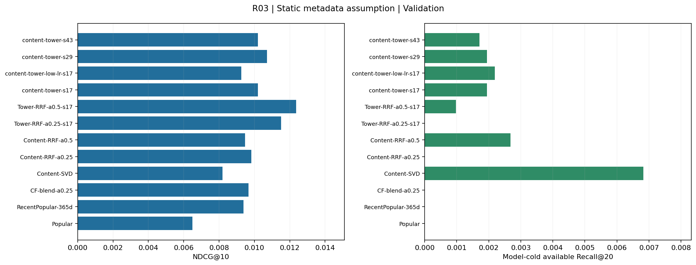
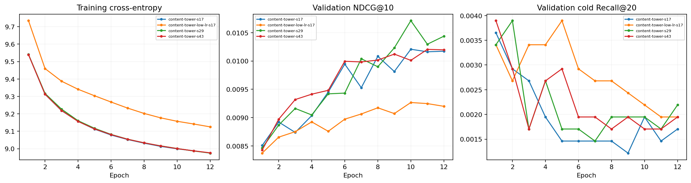
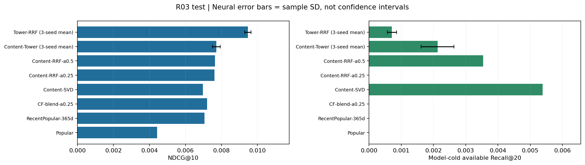

# EvoRec R03：内容召回与神经双塔

状态：completed｜协议：b84be690895554be｜更新：2026-09-15T09:16:02.603292+00:00

本轮使用新的用户哈希分组，用户与 R01 / R02 不重合；商品与时间区间仍重合。

商品标题与类别来自静态快照，缺少历史版本时间戳。以下结果成立于静态内容可用假设，不证明严格历史内容回放或线上收益。

文本词表、IDF、SVD 和双塔参数只使用本轮训练商品 / 交互；商品目录中的其他内容仅经过冻结编码器转换。

每轮训练自动更新本页；HTML 每 30 秒刷新。完成后保留结果，不自动重复调参。

验证集选中的双塔学习率为 0.001。

按验证 NDCG@10 选中的单次方法为 Tower-RRF-a0.5-s17；测试 NDCG@10=0.009400，模型冷且可用分组 Recall@20=0.000851。

纯内容路径的测试冷商品 Recall@20=0.005389。内容可进入候选与整体排序质量需要分别评价。

双塔融合的三种子测试 NDCG@10 为 0.009470 ± 0.000176，相对本轮 CF-blend-a0.25 的观测差值为 +31.4%。尚未进行显著性检验。

纯内容路径保留了更多冷商品命中，融合方法的整体排序更好但冷商品命中更少。当前已打通候选入口，绝对召回率仍需继续改善。

## 验证集

| 方法 | NDCG@10 | Recall@20 | 候选 Recall@200 | 冷商品 Recall@20 | 冷商品候选 Recall@200 |
| --- | ---: | ---: | ---: | ---: | ---: |
| Popular | 0.006501 | 0.017926 | 0.085581 | 0.000000 | 0.000000 |
| RecentPopular-365d | 0.009376 | 0.036715 | 0.149099 | 0.000000 | 0.000000 |
| CF-blend-a0.25 | 0.009672 | 0.037232 | 0.149358 | 0.000000 | 0.000000 |
| Content-SVD | 0.008188 | 0.030509 | 0.120831 | 0.006819 | 0.023380 |
| Content-RRF-a0.25 | 0.009824 | 0.037490 | 0.151513 | 0.000000 | 0.006819 |
| Content-RRF-a0.5 | 0.009473 | 0.034301 | 0.145393 | 0.002679 | 0.015100 |
| Tower-RRF-a0.25-s17 | 0.011504 | 0.039042 | 0.150823 | 0.000000 | 0.001948 |
| Tower-RRF-a0.5-s17 | 0.012366 | 0.039473 | 0.147289 | 0.000974 | 0.009011 |
| content-tower-s17 | 0.010207 | 0.034646 | 0.132552 | 0.001948 | 0.016561 |
| content-tower-low-lr-s17 | 0.009267 | 0.031802 | 0.130828 | 0.002192 | 0.021919 |
| content-tower-s29 | 0.010711 | 0.034991 | 0.132035 | 0.001948 | 0.016805 |
| content-tower-s43 | 0.010205 | 0.034215 | 0.132810 | 0.001705 | 0.017292 |

## 训练曲线

## 冻结模型后的测试结果

| 方法 | NDCG@10 | Recall@20 | 候选 Recall@200 | 冷商品 Recall@20 | 冷商品候选 Recall@200 |
| --- | ---: | ---: | ---: | ---: | ---: |
| Popular | 0.004418 | 0.013199 | 0.058888 | 0.000000 | 0.000000 |
| RecentPopular-365d | 0.007050 | 0.029522 | 0.101765 | 0.000000 | 0.000000 |
| CF-blend-a0.25 | 0.007206 | 0.029991 | 0.102624 | 0.000000 | 0.000000 |
| Content-SVD | 0.006974 | 0.026007 | 0.085754 | 0.005389 | 0.019569 |
| Content-RRF-a0.25 | 0.007612 | 0.029913 | 0.106061 | 0.000000 | 0.005389 |
| Content-RRF-a0.5 | 0.007645 | 0.029366 | 0.102937 | 0.003545 | 0.013897 |
| content-tower-s17 | 0.007708 | 0.028194 | 0.094970 | 0.002552 | 0.017300 |
| Tower-RRF-a0.5-s17 | 0.009400 | 0.031240 | 0.103796 | 0.000851 | 0.010068 |
| content-tower-s29 | 0.007933 | 0.028507 | 0.095283 | 0.002269 | 0.018293 |
| Tower-RRF-a0.5-s29 | 0.009671 | 0.031162 | 0.103639 | 0.000567 | 0.010210 |
| content-tower-s43 | 0.007502 | 0.028194 | 0.095205 | 0.001560 | 0.017158 |
| Tower-RRF-a0.5-s43 | 0.009340 | 0.031006 | 0.103561 | 0.000709 | 0.009501 |

### 三种子均值与波动

| 系列 / 指标 | 均值 | 样本标准差 |
| --- | ---: | ---: |
| Content-Tower / ndcg@10 | 0.007714 | 0.000215 |
| Content-Tower / recall@20 | 0.028298 | 0.000180 |
| Content-Tower / candidate_recall@200 | 0.095153 | 0.000163 |
| Content-Tower / cold_recall@20 | 0.002127 | 0.000511 |
| Content-Tower / cold_candidate_recall@200 | 0.017584 | 0.000618 |
| Tower-RRF / ndcg@10 | 0.009470 | 0.000176 |
| Tower-RRF / recall@20 | 0.031136 | 0.000119 |
| Tower-RRF / candidate_recall@200 | 0.103666 | 0.000119 |
| Tower-RRF / cold_recall@20 | 0.000709 | 0.000142 |
| Tower-RRF / cold_candidate_recall@200 | 0.009926 | 0.000375 |

均值来自三个独立模型指标，不是预测集成；标准差不是置信区间，本轮没有进行显著性检验。

## 可达性与样本数

| 项目 | 数量 |
| --- | ---: |
| all_positive_events | 12804 |
| model_cold_available | 7052 |
| target_unavailable | 431 |
| target_has_content_vector | 12800 |
| queries_with_content_history | 5342 |
| cold_available_target_has_vector | 7049 |

分组有交叉，不能相加。缺失内容或全历史无法表示的请求使用近期热门回退。

## 证据

- [结果、种子、配置和指标](results.json)
- [预先固定的协议](../r03-content-protocol.md)
- 原始内容、编码器、模型、代码快照及请求记录保存在本地运行目录，文件哈希随结果记录。
- 精确检索在每个请求的合法商品集合中排序；批量 GPU 耗时不等于在线 p95。
- TF-IDF/SVD 是统计文本表示；双塔是可训练 MLP，不使用预训练语言模型。
