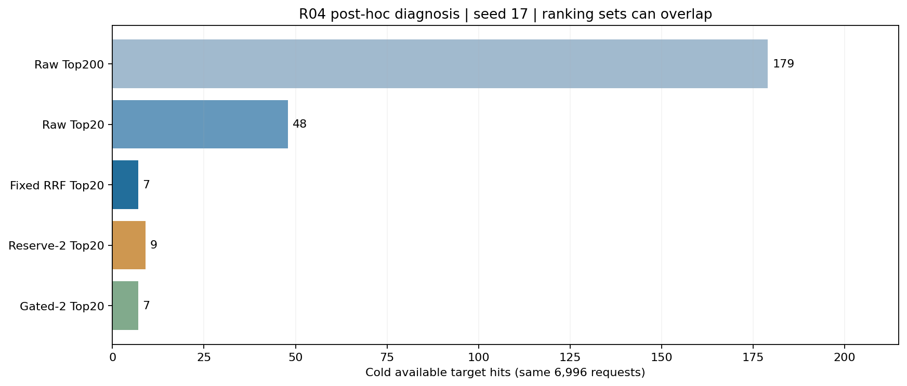

# R04：冷商品落选位置分析

这是正式选型完成后的描述性分析，允许读取目标标签来解释失败；不据此回改 R04 门槛，也不把它当作新的未见测试。

本轮 seed 17 有 6,996 个模型冷且可用目标；3,138 个请求有历史，3,138 个至少有一个可表示历史，1,466 个通过门控条件。

| 同一批冷目标中的命中位置 | 命中数 |
| --- | ---: |
| Raw Top200 | 179 |
| Raw Top20 | 48 |
| Fixed RRF Top20 | 7 |
| Reserve-2 Top20 | 9 |
| Gated-2 Top20 | 7 |

固定内容 Top20 中的 48 个目标命中，有 46 个未保留在固定融合 Top20。与此同时，6,817 个目标连固定内容 Top200 也没有进入。候选表示与最终排序都存在瓶颈。

无门槛 reserve-2 相对固定融合新增 2 个命中、丢失 0 个；gated-2 新增 0 个、丢失 0 个。增加冷商品位置只保证曝光数量，不保证被放入的就是相关商品。

其中 3,858 个冷目标请求没有历史，当前内容路径会回退到仅含训练商品的近期热门。因此不能把所有候选缺失都归因为文本表示差；后续需分别报告有历史和冷用户分组，避免将信息不足混入模型能力判断。

下一项研究应分别评价内容候选质量与候选内排序。优先在训练内部构造按时间滚动的模拟冷商品任务，让排序模型学习用户—候选的相对相关性；验证阶段同时约束整体质量和冷商品效果。固定候选、无学习融合、无冷商品训练目标应作为消融。所有模型选择都需要新的未使用用户分组。

这是一项由失败分析形成的待检验假设，尚未实现新排序模型，也没有新的提升结论。

[原始统计及轨迹指纹](error-analysis.json) · [正式 R04 报告](report.md)
