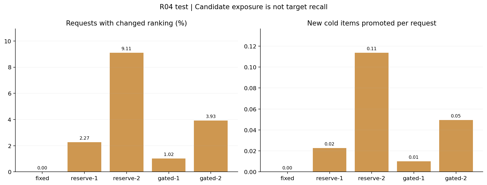

# EvoRec R04：冷商品保留与规则门控

状态：completed｜协议：e0b682ce2ecfbae6｜完成时间：2026-09-15T14:55:12.236879+00:00

验证集选中 fixed。整体 NDCG@10 下限预先固定为原融合的 97%，本轮下限为 0.012278。

五种策略的验证冷商品 Recall@20 相同，增加保留位置没有提供选型收益；同分时按整体 NDCG、保留数量与声明顺序选择，原融合保留。

选中策略的三个冻结模型测试 NDCG@10 为 0.009745 ± 0.000297；冷商品 Recall@20 为 0.000858 ± 0.000248。

± 表示模型种子间样本标准差，不是置信区间或集成结果。本轮没有显著性检验。

本轮没有新增训练：TF-IDF、SVD、三个双塔检查点及协同统计均来自冻结的 R03 训练数据。新用户早期行为只用于请求历史。

门控只读取请求时可见历史的可表示数量与一致性，不读取目标商品或命中标签。两个候选路径仍全部计算，因此不能声称节省了推理成本。

冷商品指从未出现在冻结 R03 训练交互中的商品（含负反馈记录）；可用性按完整类别首次交互时间代理。静态标题与类别缺少历史版本时间戳。

R04 与之前用户不重合，但商品和时间重合。只能在本轮相同协议内比较，不能把跨轮分数差写成模型提升。

## 验证集选型

| 方法 | 整体 NDCG@10 | 整体 Recall@20 | 冷商品 Recall@20 | 冷命中 / 冷目标 |
| --- | ---: | ---: | ---: | ---: |
| fixed-s17 | 0.012658 | 0.039616 | 0.001730 | 7 / 4047 |
| reserve-1-s17 | 0.012658 | 0.039616 | 0.001730 | 7 / 4047 |
| reserve-2-s17 | 0.012557 | 0.039616 | 0.001730 | 7 / 4047 |
| gated-1-s17 | 0.012658 | 0.039616 | 0.001730 | 7 / 4047 |
| gated-2-s17 | 0.012608 | 0.039616 | 0.001730 | 7 / 4047 |

## 冻结选型后的测试

| 方法 | 整体 NDCG@10 | 整体 Recall@20 | 冷商品 Recall@20 | 冷命中 / 冷目标 |
| --- | ---: | ---: | ---: | ---: |
| Popular | 0.004642 | 0.011800 | 0.000000 | 0 / 6996 |
| CF-blend-a0.25 | 0.007739 | 0.028757 | 0.000000 | 0 / 6996 |
| Content-SVD | 0.007171 | 0.023756 | 0.006861 | 48 / 6996 |
| fixed-s17 | 0.009402 | 0.029851 | 0.001001 | 7 / 6996 |
| reserve-1-s17 | 0.009402 | 0.029851 | 0.001001 | 7 / 6996 |
| reserve-2-s17 | 0.009379 | 0.029929 | 0.001286 | 9 / 6996 |
| gated-1-s17 | 0.009402 | 0.029851 | 0.001001 | 7 / 6996 |
| gated-2-s17 | 0.009402 | 0.029773 | 0.001001 | 7 / 6996 |
| fixed-s29 | 0.009932 | 0.029382 | 0.000572 | 4 / 6996 |
| fixed-s43 | 0.009901 | 0.029616 | 0.001001 | 7 / 6996 |

下图为预先登记的 seed 17 消融。其测试结果不会用于回改选中策略。

## 曝光与门控活动

reserve 表示无门槛保留；gated 额外要求至少 2 个可表示历史商品，且加权平均单位向量的模长不低于 0.6。历史权重按 0.8 衰减。

已有 Top20 冷商品会受保护。quota=1 尝试保留到第 20 位；quota=2 尝试放在第 10、20 位。原候选已满足数量、内容候选缺少冷商品或门槛未通过时不改列表。

## 多种子汇总

| 策略 / 指标 | 均值 | 样本标准差 |
| --- | ---: | ---: |
| fixed / ndcg@10 | 0.009745 | 0.000297 |
| fixed / recall@20 | 0.029616 | 0.000234 |
| fixed / candidate_recall@200 | 0.103436 | 0.000477 |
| fixed / cold_recall@20 | 0.000858 | 0.000248 |
| fixed / cold_candidate_recall@200 | 0.012436 | 0.000248 |

## 样本与证据

查询样本 224,947 条交互、137,575 名用户；验证 11,460 个正反馈事件，测试 12,797 个。

- [配置、数据指纹、各分组与逐请求轨迹索引](results.json)
- [实验前登记的协议](../r04-gating-protocol.md)
- [独立审计](../../validation/gating-checks.json)
- [测试后的失败定位（不参与选型）](error-analysis.md)
- [运行说明](../../../research/R04-gating-guide.md)

原始数据、模型和压缩轨迹位于本地忽略目录；机器可读摘要进入文档归档。
