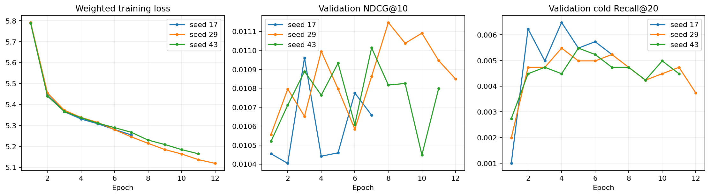

# R05 冷加权模型复验与用户聚类区间

状态：completed；复验编号：6b62e8a852b43d38

本轮是原 R05 的固定配置复验及事后统计补充，旧测试已经查看，不是新的封闭测试。

训练样例、候选池、编码器、模型结构、损失权重和优化设置均固定；只补种子并重放 seed 17。

逐种子最佳轮次仅由全体验证 NDCG@10 选定。没有按测试结果重新选择方法或种子。

## 训练

| 种子 | 最佳轮次 | 实际轮数 | 重载验证 |
| --- | ---: | ---: | --- |
| 17 | 3 | 7 | True |
| 29 | 8 | 12 | True |
| 43 | 7 | 11 | True |

## 测试结果

| 方法 | 整体 NDCG@10 | 有历史 NDCG@10 | 冷 Recall@20 | 冷命中 |
| --- | ---: | ---: | ---: | ---: |
| RRF | 0.006537 | 0.003702 | 0.000847 | 6 / 7088 |
| CF-blend | 0.007188 | 0.005291 | 0.000000 | 0 / 7088 |
| ColdListMLP-s17 | 0.009119 | 0.010002 | 0.003668 | 26 / 7088 |
| ColdListMLP-s29 | 0.009761 | 0.011567 | 0.003386 | 24 / 7088 |
| ColdListMLP-s43 | 0.009066 | 0.009873 | 0.003809 | 27 / 7088 |

冷加权三种子整体 NDCG@10=0.009315 ± 0.000387；冷目标 Recall@20=0.003621 ± 0.000216。± 是种子间样本标准差，不是置信区间。

## 配对用户区间

以下展示三个固定种子的逐请求指标平均相对基线的差值。它不是集成排序器；区间条件于固定检查点，只反映用户抽样不确定性。完整 48 项比较见 uncertainty.json。

| 分组 / 指标 | 对照 | 差值 | 95% 边际区间 |
| --- | --- | ---: | --- |
| all_positive_events / ndcg@10 | RRF | +0.002778 | [+0.001894, +0.003701] |
| all_positive_events / ndcg@10 | CF-blend | +0.002127 | [+0.001341, +0.002953] |
| history_present / ndcg@10 | RRF | +0.006778 | [+0.004669, +0.009016] |
| history_present / ndcg@10 | CF-blend | +0.005189 | [+0.003285, +0.007164] |
| model_cold_available / recall@20 | RRF | +0.002775 | [+0.001609, +0.004069] |
| model_cold_available / recall@20 | CF-blend | +0.003621 | [+0.002350, +0.005015] |

区间未进行多重比较校正；不能据 48 项中的个别区间声称总体显著。用户聚类未处理跨用户的共同商品和时间冲击，也不包含训练随机性。静态元数据、低候选覆盖和离线业务边界保持不变。

审计：111,039 条记录，22,207,800 次候选检查；seed 17 原始测试排名逐请求一致。

[完整区间](uncertainty.json) · [机器可读结果](results.json)
