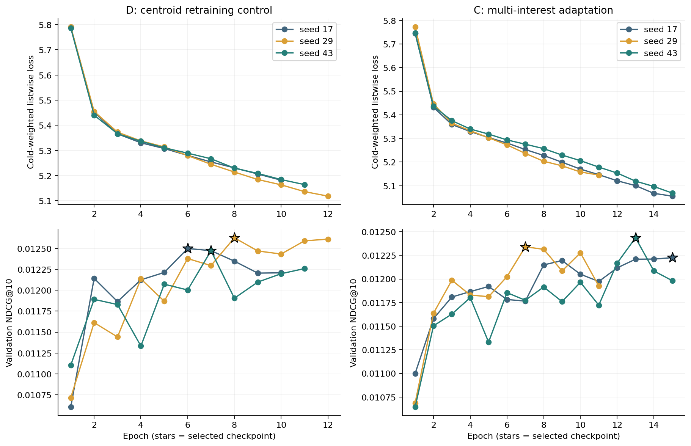
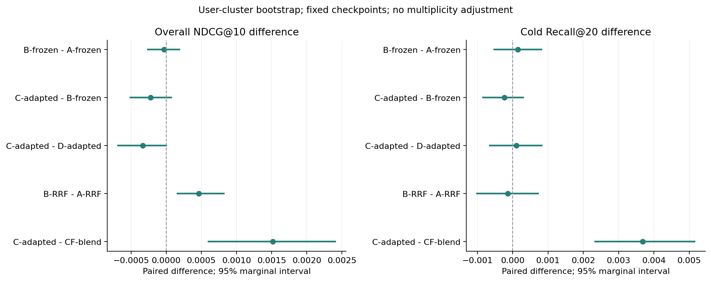

# R06 同预算多兴趣召回与排序适配

状态：completed，审计 passed。协议：e11840f33a2fec8d。实际训练代码：bf73ce7b002d7fa9ca3c327dc291efea6b42c908。

新用户桶与 R01–R05 用户交集为零；全部检查点及验证选型落盘后才开放测试。日历、商品和静态元数据假设仍与旧轮重合。

A/B 使用原 R05 冻结检查点；C/D 在 R06 验证集选轮。A/D 使用均值召回，B/C 使用均值＋近期多兴趣召回。CF 200、内容 200、并集最多 400。

**验证规则选中：A-frozen-s17**。质量下限：0.011508。测试结果不参与重新选型。

## 候选覆盖与排名

## 结果解读

结论：本轮不支持用多兴趣路径替换原路径；验证规则保留 A-frozen-s17，不按测试结果重新选型。

同样的候选数量预算下，冷目标入池由 115 / 6978 提高到 122 / 6978（1.648% → 1.748%）。这是描述性覆盖变化，不等于排序收益。

无历史冷目标仍为 0 / 3928；该人群没有从近期多兴趣表示受益。

固定排序器的 B-A 与匹配重训练的 C-D，整体 NDCG 和冷 Recall 的预登记区间均跨过零。C-D 的整体 NDCG 上界很接近零但仍为正，不能据四舍五入宣称确定下降。

B-RRF 相对 A-RRF 的整体 NDCG 边际区间为正，说明收益依赖排序方法；C 相对 CF 的优势也不能解释成多兴趣相对均值召回的独立优势。

| 方法族 | 整体 NDCG@10 均值 ± 样本标准差 | 冷 Recall@20 均值 ± 样本标准差 |
| --- | --- | --- |
| A-frozen | 0.010074 ± 0.000129 | 0.003774 ± 0.000361 |
| B-frozen | 0.010040 ± 0.000117 | 0.003917 ± 0.000503 |
| C-adapted | 0.009820 ± 0.000216 | 0.003678 ± 0.000298 |
| D-adapted | 0.010155 ± 0.000027 | 0.003583 ± 0.000143 |

下面保留全部方法的单次结果。

| 方法 | 整体 NDCG@10 | 有历史 NDCG@10 | 冷 Recall@20 | 冷 Top20 命中 |
| --- | --- | --- | --- | --- |
| CF-blend | 0.008306 | 0.006944 | 0.000000 | 0 / 6978 |
| A-RRF | 0.007538 | 0.005058 | 0.001576 | 11 / 6978 |
| B-RRF | 0.008000 | 0.006193 | 0.001433 | 10 / 6978 |
| A-frozen-s17 | 0.009927 | 0.010925 | 0.004156 | 29 / 6978 |
| B-frozen-s17 | 0.009944 | 0.010967 | 0.004443 | 31 / 6978 |
| A-frozen-s29 | 0.010170 | 0.011520 | 0.003439 | 24 / 6978 |
| B-frozen-s29 | 0.010171 | 0.011524 | 0.003439 | 24 / 6978 |
| A-frozen-s43 | 0.010125 | 0.011409 | 0.003726 | 26 / 6978 |
| B-frozen-s43 | 0.010005 | 0.011116 | 0.003869 | 27 / 6978 |
| D-adapted-s17 | 0.010172 | 0.011525 | 0.003583 | 25 / 6978 |
| D-adapted-s29 | 0.010170 | 0.011520 | 0.003439 | 24 / 6978 |
| D-adapted-s43 | 0.010125 | 0.011409 | 0.003726 | 26 / 6978 |
| C-adapted-s17 | 0.009644 | 0.010230 | 0.004013 | 28 / 6978 |
| C-adapted-s29 | 0.010061 | 0.011253 | 0.003439 | 24 / 6978 |
| C-adapted-s43 | 0.009754 | 0.010501 | 0.003583 | 25 / 6978 |

## 分组候选覆盖

| 候选路径 | 分组 | 请求数 | 目标入池数 | 入池率 | 平均并集大小 |
| --- | --- | --- | --- | --- | --- |
| A | all_positive_events | 12524 | 1481 | 0.118253 | 281.16 |
| A | history_present | 5101 | 616 | 0.120761 | 399.27 |
| A | cold_user | 7423 | 865 | 0.116530 | 200.00 |
| A | model_cold_available | 6978 | 115 | 0.016480 | 287.11 |
| A | history_cold_available | 3050 | 115 | 0.037705 | 399.30 |
| A | no_history_cold_available | 3928 | 0 | 0.000000 | 200.00 |
| B | all_positive_events | 12524 | 1490 | 0.118972 | 281.14 |
| B | history_present | 5101 | 625 | 0.122525 | 399.21 |
| B | cold_user | 7423 | 865 | 0.116530 | 200.00 |
| B | model_cold_available | 6978 | 122 | 0.017484 | 287.09 |
| B | history_cold_available | 3050 | 122 | 0.040000 | 399.24 |
| B | no_history_cold_available | 3928 | 0 | 0.000000 | 200.00 |

## 训练与选轮

| 模型 | 实际轮数 | 最佳轮次 | 重载一致 |
| --- | --- | --- | --- |
| D-adapted-s17 | 10 | 6 | True |
| D-adapted-s29 | 12 | 8 | True |
| D-adapted-s43 | 11 | 7 | True |
| C-adapted-s17 | 15 | 15 | True |
| C-adapted-s29 | 11 | 7 | True |
| C-adapted-s43 | 15 | 13 | True |

## 配对用户区间

共 50 项预登记比较。三个固定种子的逐请求指标平均不是集成排序器；图中的区间条件于固定检查点，不包含训练随机性，未做多重比较校正。全部区间见 [uncertainty.json](uncertainty.json)。

| 比较 | 分组与指标 | 配对差值 | 95% 边际区间 |
| --- | --- | --- | --- |
| B-frozen − A-frozen | 整体 NDCG@10 | -0.000033769 | [-0.000260567, +0.000184014] |
| C-adapted − B-frozen | 整体 NDCG@10 | -0.000220396 | [-0.000511217, +0.000070782] |
| C-adapted − D-adapted | 整体 NDCG@10 | -0.000335551 | [-0.000686012, +0.000000421] |
| B-RRF − A-RRF | 整体 NDCG@10 | +0.000462171 | [+0.000160787, +0.000818927] |
| C-adapted − CF-blend | 整体 NDCG@10 | +0.001513787 | [+0.000603256, +0.002404126] |
| B-frozen − A-frozen | 冷 Recall@20 | +0.000143308 | [-0.000527426, +0.000814653] |
| C-adapted − B-frozen | 冷 Recall@20 | -0.000238846 | [-0.000837691, +0.000295004] |
| C-adapted − D-adapted | 冷 Recall@20 | +0.000095538 | [-0.000648898, +0.000820548] |
| B-RRF − A-RRF | 冷 Recall@20 | -0.000143308 | [-0.001007774, +0.000712558] |
| C-adapted − CF-blend | 冷 Recall@20 | +0.003678227 | [+0.002334641, +0.005148765] |

## 计算成本

| 阶段 | CF 拟合及排名秒 | 均值内容秒 | 新增多兴趣秒 | 均值向量点积数 | 多兴趣向量点积数 |
| --- | --- | --- | --- | --- | --- |
| train 2017-2019 | 11.533 | 12.341 | 17.877 | 1646988000 | 13175904000 |
| train 2020-2021 | 10.034 | 9.388 | 13.792 | 1274631463 | 10197051704 |
| validation | 10.172 | 6.695 | 11.116 | 1588108179 | 12652161816 |
| test | 11.876 | 7.865 | 12.469 | 1718906476 | 13466322884 |

A/B 共享 CF 与均值内容计算；新增多兴趣耗时含对象初始化，详细融合及特征构造耗时见结果 JSON。单次离线批处理观测受缓存与设备状态影响，不是线上延迟或稳定性能基准。

## 验证和边界

完整重放 45,382 条候选来源请求与 361,425 条排名记录，共 138,921,354 次候选检查。均值路径训练缓存与 R05 完全一致，所有新检查点重载验证通过。

低召回分母、缺失历史、静态元数据和候选遗漏均保留。新排序器的训练正例取决于实际候选覆盖；C-D 是匹配重训练对照，C-B 同时包含重新选轮，不能作单一因素归因。

[协议](../r06-multi-interest-protocol.md) · [运行指南](../../../research/R06-multi-interest-guide.md) · [机器可读结果](results.json) · [图表来源](figures/manifest.json)
