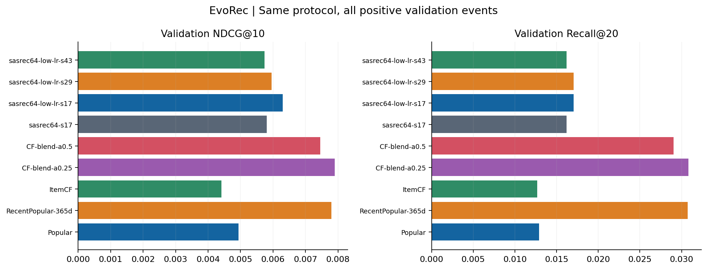
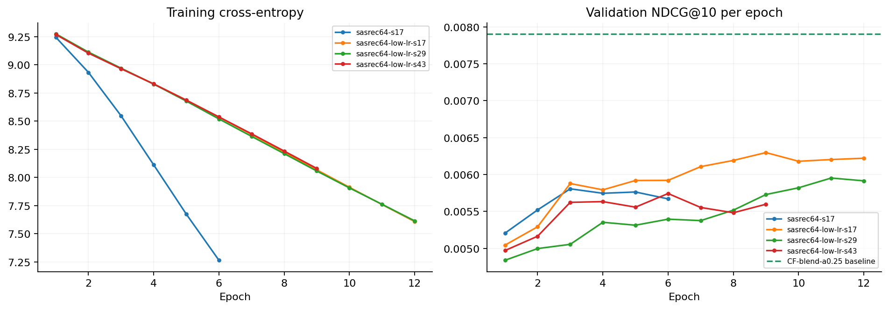

# EvoRec 持续实验报告

更新：2026-09-15T07:51:46.275612+00:00｜状态：本轮训练已完成｜协议：47e66889b76aaf36

本页在每轮训练结束后自动更新；打开 HTML 后每 30 秒刷新。训练结束后保留最后结果，不会自动启动下一轮。

仅比较相同样本、时间边界和评价口径；R01 前缀样本结果单独归档。

训练设备：NVIDIA GeForce RTX 4060 Laptop GPU；训练样本 54,060，验证事件 11,613。模型选型和早停只读取验证集。

## 本轮发现

按预先指定的验证 NDCG@10 比较，当前首选方法为 CF-blend-a0.25；其测试 NDCG@10 为 0.008380。

相对同协议 Popular，首选方法的测试 NDCG@10 高 76.2%；序列模型三种子均值高 18.4%。这是该样本的相对差值，尚未做统计显著性检验。

序列模型仍未超过首选基线。训练损失持续下降时，验证效果已出现停滞或退化，因此保留验证最佳检查点。

测试集 12,614 个正反馈事件中，6,874 个目标属于训练交互未覆盖但当时可用的商品，所有当前方法在该组的 Recall@20 都为 0。下一轮需验证内容候选路径。

## 验证集比较

| 方法 | N | 验证 NDCG@10 | 验证 Recall@20 | 候选 Recall@200 |
| --- | ---: | ---: | ---: | ---: |
| Popular | 11613 | 0.004933 | 0.012917 | 0.080169 |
| RecentPopular-365d | 11613 | 0.007800 | 0.030741 | 0.144924 |
| ItemCF | 11613 | 0.004407 | 0.012658 | 0.079652 |
| CF-blend-a0.25 | 11613 | 0.007905 | 0.030828 | 0.146732 |
| CF-blend-a0.5 | 11613 | 0.007451 | 0.029019 | 0.146646 |
| sasrec64-s17 | 11613 | 0.005807 | 0.016189 | 0.089038 |
| sasrec64-low-lr-s17 | 11613 | 0.006298 | 0.017050 | 0.089210 |
| sasrec64-low-lr-s29 | 11613 | 0.005953 | 0.017050 | 0.088263 |
| sasrec64-low-lr-s43 | 11613 | 0.005743 | 0.016189 | 0.090416 |

## 训练过程

| 训练 | 已完成轮数 | 最佳轮次 | 训练、评估和报告总耗时（秒） |
| --- | ---: | ---: | ---: |
| sasrec64-s17 | 6 | 3 | 60.60 |
| sasrec64-low-lr-s17 | 12 | 9 | 100.42 |
| sasrec64-low-lr-s29 | 12 | 11 | 94.36 |
| sasrec64-low-lr-s43 | 9 | 6 | 68.62 |

训练损失下降不等于推荐效果提高。按验证 NDCG@10 保存最佳检查点，保留退化和未超过基线的实验。

## 冻结模型后的测试结果

| 方法 | N | NDCG@10 | Recall@20 | 候选 Recall@200 |
| --- | ---: | ---: | ---: | ---: |
| Popular | 12614 | 0.004755 | 0.011654 | 0.064452 |
| RecentPopular-365d | 12614 | 0.008243 | 0.029808 | 0.104249 |
| ItemCF | 12614 | 0.004422 | 0.011257 | 0.063977 |
| CF-blend-a0.25 | 12614 | 0.008380 | 0.030046 | 0.105201 |
| CF-blend-a0.5 | 12614 | 0.007993 | 0.029015 | 0.105518 |
| sasrec64-low-lr-s17 | 12614 | 0.005880 | 0.015776 | 0.070477 |
| sasrec64-low-lr-s29 | 12614 | 0.005544 | 0.014983 | 0.069209 |
| sasrec64-low-lr-s43 | 12614 | 0.005460 | 0.015221 | 0.070398 |

### 序列模型三种子汇总

| 指标 | 均值 | 样本标准差 |
| --- | ---: | ---: |
| ndcg@10 | 0.005628 | 0.000222 |
| recall@20 | 0.015327 | 0.000407 |
| candidate_recall@200 | 0.070028 | 0.000711 |

种子：17、29、43。先在种子 17 比较两组学习率，再重复所选配置；三个种子分别用验证集选择最佳轮次。

### 分组有效样本

| 分组 | 测试事件数 |
| --- | ---: |
| 全部正反馈 | 12614 |
| 目标当时可用 | 12171 |
| 有正反馈历史 | 5159 |
| 无正反馈历史 | 7455 |
| 模型冷且可用 | 6874 |

上述分组存在交叉，不能相加；无历史与模型冷商品描述不同维度。各方法分组指标保存在结果 JSON。

## 证据与边界

- [机器可读结果](training-results.json)。
- [本轮协议与环境说明](r02-protocol.md)。
- [独立轨迹审计](../validation/training-checks.json)。
- 完整类别首次交互严格早于请求，作为商品可用性代理；它不是实际商品上架时间。
- 评论评分作为隐式兴趣代理；本轮不证明商业 CTR、线上延迟或生成式推荐效果。
- SASRec-CE 使用全词表交叉熵、训练频率偏置和本项目 Transformer 配置，不宣称严格复现原论文。
- 三种子均值来自三个独立模型的指标，未做预测集成；样本标准差不是置信区间。
- GPU 分批评估未提供单请求延迟分位数；显存指标是训练进程截至该点的累计峰值。
- 研究环境复用了系统包；依赖快照与安装边界见协议文档。本轮测试已查看，后续调参需预注册新的时间窗口或留出协议。
